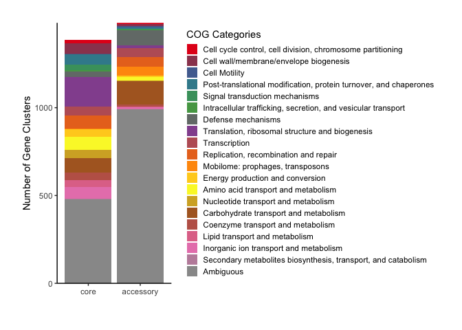
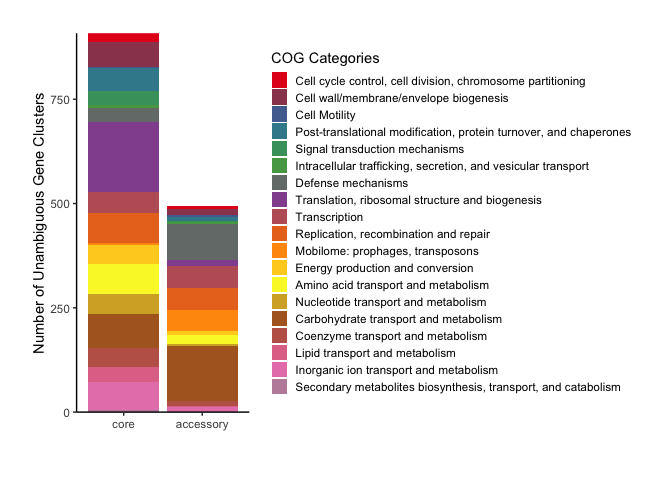
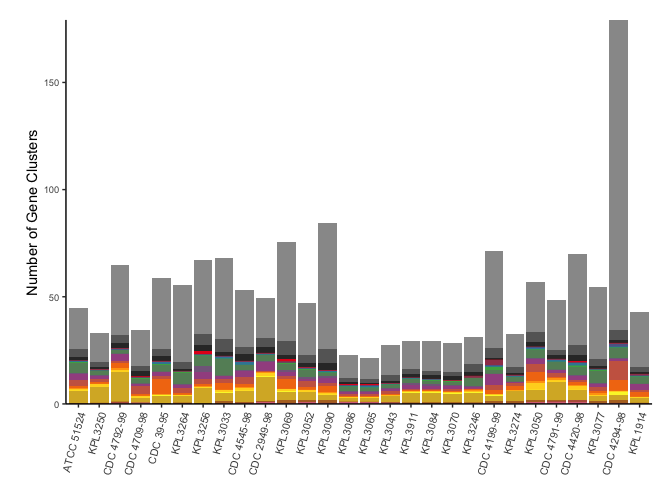
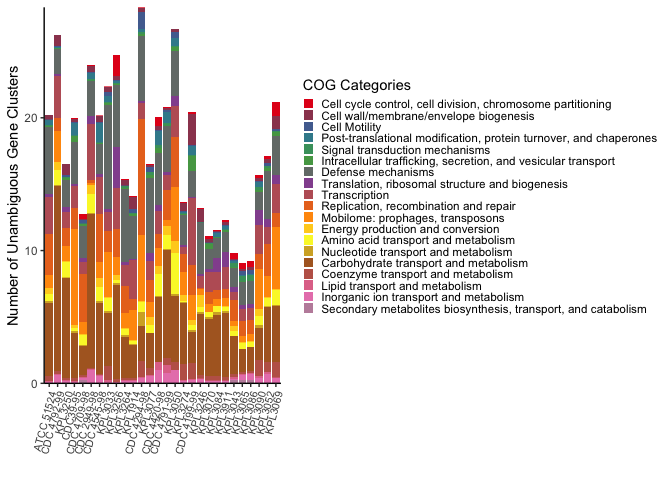
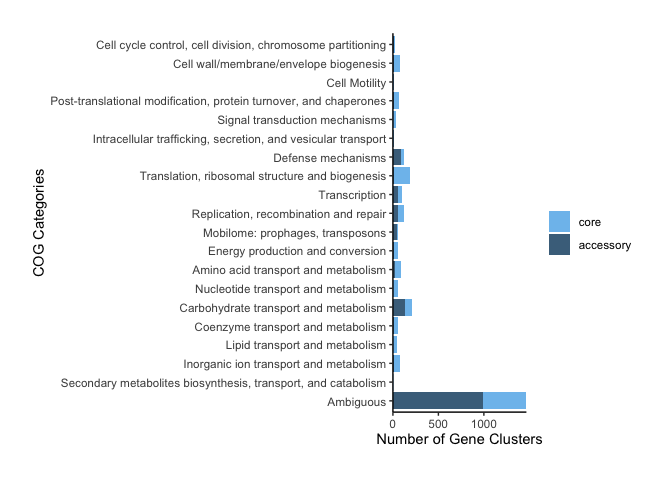
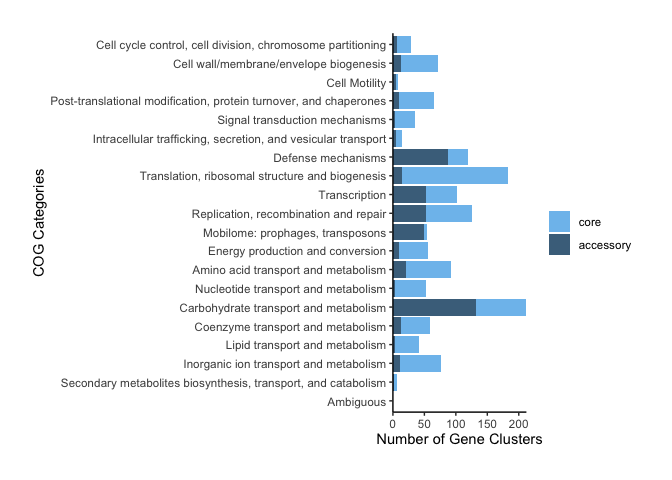

*Dolosigranulum pigrum* COG ANALYSIS
================

## Data Input

We import the output of `anvi-summarize` and select the most relevant
variables for the functional analysis:

``` r
DpigPangenome <- read_csv("Dpi_Prokka_Pan_t28_gene_clusters_summary.csv")
DpigPangenome <- DpigPangenome %>%
  select(unique_id, gene_cluster_id, bin_name, genome_name, num_genomes_gene_cluster_has_hits, num_genes_in_gene_cluster, `Prokka:Prodigal_ACC`, `Prokka:Prodigal`, COG_CATEGORY, COG_FUNCTION, COG_FUNCTION_ACC)
```

New variable “accessory\_vs\_core” where we define “core” as
“MC\_core”+“SC\_core”+“soft\_core” and “accessory” as
“shell”+“cloud”:

``` r
DpigPangenome<-DpigPangenome %>%
  mutate(accessory_vs_core=ifelse(bin_name=="MC_core"|bin_name=="SC_core"|bin_name=="soft_core","core","accessory"))
```

The number of genes and proportions of accessory vs. core are:

``` r
nrow(DpigPangenome %>% group_by(gene_cluster_id) %>% filter(accessory_vs_core =="accessory") %>% summarise)
```

    ## [1] 1483

``` r
nrow(DpigPangenome %>% group_by(gene_cluster_id) %>% filter(accessory_vs_core =="core") %>% summarise)
```

    ## [1] 1386

``` r
100*nrow(DpigPangenome %>% group_by(gene_cluster_id) %>% filter(accessory_vs_core =="accessory") %>% summarise)/nrow(DpigPangenome %>% group_by(gene_cluster_id) %>% summarise)
```

    ## [1] 51.69048

``` r
100*nrow(DpigPangenome %>% group_by(gene_cluster_id) %>% filter(accessory_vs_core =="core") %>% summarise)/nrow(DpigPangenome %>% group_by(gene_cluster_id) %>% summarise)
```

    ## [1] 48.30952

New variables to identify the ambiguous COG annotations calls, both at
the COG category and COG function levels. \* If the COG\_FUNCTION\_ACC
is ambiguous (for example COG4409|COG4932) it gets labeled like a mix
function (“mixF”). \* If the COG\_CATEGORY is ambiguous (for example
G|S|M) it gets labeled like a mix category (“mixC”). \* Also missing
values are flagged as “NA”.

``` r
DpigPangenome$COG_FUNCTION_CLEAN <- DpigPangenome$COG_FUNCTION_ACC
DpigPangenome$COG_FUNCTION_CLEAN[is.na(DpigPangenome$COG_FUNCTION_ACC)]<-"NA"
DpigPangenome$COG_FUNCTION_CLEAN[grepl('|', DpigPangenome$COG_FUNCTION_ACC,fixed=TRUE)]<-"mixF"

DpigPangenome$COG_CATEGORY_CLEAN <- DpigPangenome$COG_CATEGORY
DpigPangenome$COG_CATEGORY_CLEAN[is.na(DpigPangenome$COG_CATEGORY)]<-"NA"
DpigPangenome$COG_CATEGORY_CLEAN[grepl('|', DpigPangenome$COG_CATEGORY,fixed=TRUE)]<-"mixC"
```

New variable with all the ambiguous calls combined:

``` r
DpigPangenome$UnambiguousCategory <- DpigPangenome$COG_CATEGORY
DpigPangenome$UnambiguousCategory[is.na(DpigPangenome$COG_FUNCTION_ACC)]<- "Ambiguous"
DpigPangenome$UnambiguousCategory[DpigPangenome$COG_CATEGORY_CLEAN =="S"]<- "Ambiguous"
DpigPangenome$UnambiguousCategory[DpigPangenome$COG_CATEGORY_CLEAN =="R"]<- "Ambiguous"
DpigPangenome$UnambiguousCategory[DpigPangenome$COG_CATEGORY_CLEAN =="mixC"]<- "Ambiguous"
```

## Data Summary

Summary of GOC annotated genes:

``` r
Summary <- data.frame(
  "Genes" = c("Total in Dpig Pangenome", 
              "COG Category = Non-assigned", 
              "COG Category = Function Unknown", 
              "COG Category = General function predictions only",
              "COG Category = Mixed",
              "Unambiguous"),
  "Count" = c(nrow(DpigPangenome), 
              nrow(DpigPangenome %>% filter(COG_FUNCTION_CLEAN =="NA")), 
              nrow(DpigPangenome %>% filter(COG_CATEGORY_CLEAN =="S")),
              nrow(DpigPangenome %>% filter(COG_CATEGORY_CLEAN =="R")),
              nrow(DpigPangenome %>% filter(COG_CATEGORY_CLEAN =="mixC")),
              nrow(DpigPangenome %>% filter(UnambiguousCategory !="Ambiguous"))
              )
)
Summary$Percentage <- round(100*(Summary$Count/49418),2)
```

``` r
kable(Summary)
```

| Genes                                            | Count | Percentage |
| :----------------------------------------------- | ----: | ---------: |
| Total in Dpig Pangenome                          | 49418 |     100.00 |
| COG Category = Non-assigned                      |  9333 |      18.89 |
| COG Category = Function Unknown                  |  2496 |       5.05 |
| COG Category = General function predictions only |  2733 |       5.53 |
| COG Category = Mixed                             |  4883 |       9.88 |
| Unambiguous                                      | 29973 |      60.65 |

60.65% of the gene calls are Unambiguous: this is COG Category is
Non-assigned, Function Unknown, General function predictions only or a
mixed Category.

## COG analysis corrected by number of genes in each GC

This analysis was done at the pangenomic gene cluster level (GC). Since
many gene clusters had mixed COG category assignments a solution is to
assign each individual gene call to their corresponding
Genome/AccessoryvsCore/COG grouping weighting their contribution by
dividing their count by the number of genes in their GC.

The table “DpigCOGsbyGC” groups the genes by genome; and inside genomes
by accessory vs. core status, and nested inside as the unambiguous COG
category. But, in this case, instead of counting the elements in each
group we calculated the sum of 1/num\_genes\_in\_gene\_cluster.

``` r
DpigCOGsbyGC <-DpigPangenome %>%
  group_by(genome_name, accessory_vs_core, UnambiguousCategory) %>%
    summarise(num_corrected_genes=sum(1/num_genes_in_gene_cluster))
```

The total sum of all values in the `num_corrected_genes` variable should
add up to the number of CGs:

``` r
sum(DpigCOGsbyGC$num_corrected_genes)
```

    ## [1] 2869

``` r
nrow(DpigPangenome %>% group_by(gene_cluster_id) %>% summarise)
```

    ## [1] 2869

Defining order of COG categories and Strains

``` r
DpigCOGsbyGC$accessory_vs_core <- factor(DpigCOGsbyGC$accessory_vs_core, levels =c("core", "accessory"))

DpigCOGsbyGC$UnambiguousCategory <- factor(DpigCOGsbyGC$UnambiguousCategory, levels = c("D","M","N","O","T","U","V","J","K","L","X","C","E","F","G","H","I","P","Q","Ambiguous"))
COGlabels = c("Cell cycle control, cell division, chromosome partitioning","Cell wall/membrane/envelope biogenesis","Cell Motility","Post-translational modification, protein turnover, and chaperones","Signal transduction mechanisms","Intracellular trafficking, secretion, and vesicular transport","Defense mechanisms","Translation, ribosomal structure and biogenesis","Transcription","Replication, recombination and repair","Mobilome: prophages, transposons","Energy production and conversion","Amino acid transport and metabolism","Nucleotide transport and metabolism","Carbohydrate transport and metabolism","Coenzyme transport and metabolism","Lipid transport and metabolism","Inorganic ion transport and metabolism","Secondary metabolites biosynthesis, transport, and catabolism","Ambiguous")

DpigCOGsbyGC$genome_name <- factor(DpigCOGsbyGC$genome_name, levels = c("Dpigrum_ATCC_51524", "Dpigrum_KPL1939_CDC4792_99","Dpigrum_KPL3250","Dpigrum_KPL1922_CDC39_95","Dpigrum_KPL1934_CDC4709_98","Dpigrum_KPL1930_CDC2949_98","Dpigrum_KPL1933_CDC4545_98","Dpigrum_KPL3033","Dpigrum_KPL3256","Dpigrum_KPL3264","Dpigrum_KPL1914","Dpigrum_KPL1931_CDC4294_98","Dpigrum_KPL3077","Dpigrum_KPL1932_CDC4420_98","Dpigrum_KPL1938_CDC4791_99","Dpigrum_KPL3050","Dpigrum_KPL3274","Dpigrum_KPL1937_CDC4199_99","Dpigrum_KPL3246","Dpigrum_KPL3070","Dpigrum_KPL3084","Dpigrum_KPL3911","Dpigrum_KPL3043","Dpigrum_KPL3065","Dpigrum_KPL3086","Dpigrum_KPL3090","Dpigrum_KPL3052","Dpigrum_KPL3069"))
strainlabels = c("ATCC 51524", "CDC 4792-99","KPL3250","CDC39-95","CDC 4709-98","CDC 2949-98","CDC 4545-98","KPL3033","KPL3256","KPL3264","KPL1914","CDC 4294-98","KPL3077","CDC 4420-98","CDC 4791-99","KPL3050","KPL3274","CDC 4199-99","KPL3246","KPL3070","KPL3084","KPL3911","KPL3043","KPL3065","KPL3086","KPL3090","KPL3052","KPL3069")
```

Color Palette

``` r
colourCount <- length(unique(DpigCOGsbyGC$UnambiguousCategory))
getPalette <- colorRampPalette(brewer.pal(9, "Set1"))
```

### COG Plots Accessory vs. Core

``` r
pA <- ggplot(DpigCOGsbyGC, aes(x = accessory_vs_core, y = num_corrected_genes, fill = UnambiguousCategory)) +
  stat_summary(fun=sum ,geom="bar", position = "stack") +
  scale_fill_manual(values = getPalette(colourCount), labels=COGlabels) +
  scale_y_continuous(expand = c(0,0)) + 
  labs(fill="COG Categories", x="", y= "Number of Gene Clusters") +
  theme_classic() +
  theme(legend.key.size = unit(0.45, "cm"), plot.margin=unit(c(25,25,25,25),"pt")) 
pA
```

<!-- -->

``` r
pB <- ggplot(filter(DpigCOGsbyGC, UnambiguousCategory != "Ambiguous"), aes(x = accessory_vs_core, y = num_corrected_genes, fill = UnambiguousCategory)) +
  stat_summary(fun=sum ,geom="bar", position = "stack") +
  scale_fill_manual(values = getPalette(colourCount), labels=COGlabels) +
  scale_y_continuous(expand = c(0,0)) + 
  labs(fill="COG Categories", x="", y= "Number of Unambiguous Gene Clusters") +
  theme_classic() +
  theme(legend.key.size = unit(0.45, "cm"), plot.margin=unit(c(25,25,25,25),"pt")) 
pB
```

<!-- -->

### COG Plots by Genome

``` r
pC <- ggplot(filter(DpigCOGsbyGC, accessory_vs_core == "accessory"), aes(x=genome_name, y=num_corrected_genes, fill=UnambiguousCategory)) +
  geom_bar(stat="identity") + 
  scale_y_continuous(expand = c(0,0)) + 
  scale_x_discrete(labels = strainlabels) +
  scale_fill_manual(values = getPalette(colourCount), labels=COGlabels) + 
  labs(fill="COG Categories", x="", y= "Number of Gene Clusters") +
  theme_classic() + 
  theme(axis.text.x = element_text(size=8, angle=75, hjust=1)) +
  theme(legend.position="right",legend.key.size = unit(0.3, "cm"), plot.margin=unit(c(25,25,25,25),"pt")) +
  guides(fill=guide_legend(ncol=1, title.position = "top")) 
pC
```

<!-- -->

``` r
pD <- ggplot(filter(DpigCOGsbyGC %>% filter(UnambiguousCategory !="Ambiguous"), accessory_vs_core == "accessory"), aes(x=genome_name, y=num_corrected_genes, fill=UnambiguousCategory)) +
  geom_bar(stat="identity") + 
  scale_y_continuous(expand = c(0,0)) + 
  scale_x_discrete(labels = strainlabels) +
  scale_fill_manual(values = getPalette(colourCount), labels=COGlabels) + 
  labs(fill="COG Categories", x="", y= "Number of Unambiguous Gene Clusters") +
  theme_classic() + 
  theme(axis.text.x = element_text(size=8, angle=75, hjust=1)) +
  theme(legend.position="right",legend.key.size = unit(0.3, "cm"), plot.margin=unit(c(25,25,25,25),"pt")) +
  guides(fill=guide_legend(ncol=1, title.position = "top")) 
pD
```

<!-- -->

### COG Plots by COG Category

``` r
pE <- ggplot(DpigCOGsbyGC, aes(x = UnambiguousCategory, y = num_corrected_genes, fill = accessory_vs_core)) +
  stat_summary(fun=sum ,geom="bar", position = "stack") +
  scale_fill_manual(values = c("skyblue2", "skyblue4")) +
  scale_y_continuous(expand = c(0,0)) + 
  scale_x_discrete(labels = rev(COGlabels), limits = rev(levels(DpigCOGsbyGC$UnambiguousCategory))) +
  labs(fill="", x="COG Categories", y= "Number of Gene Clusters") +
  theme_classic() +
  theme(plot.margin=unit(c(25,25,25,25),"pt")) +
  coord_flip()
pE
```

<!-- -->

``` r
pF <- ggplot(filter(DpigCOGsbyGC %>% filter(UnambiguousCategory !="Ambiguous")), aes(x = UnambiguousCategory, y = num_corrected_genes, fill = accessory_vs_core)) +
  stat_summary(fun=sum ,geom="bar", position = "stack") +
  scale_fill_manual(values = c("skyblue2", "skyblue4")) +
  scale_y_continuous(expand = c(0,0)) + 
  scale_x_discrete(labels = rev(COGlabels), limits = rev(levels(DpigCOGsbyGC$UnambiguousCategory))) +
  labs(fill="", x="COG Categories", y= "Number of Gene Clusters") +
  theme_classic() +
  theme(plot.margin=unit(c(25,25,25,25),"pt")) +
  coord_flip()
pF
```

<!-- -->

The table “COGTotalGC” groups the genes by accessory vs. core status,
and nested inside as the unambiguous COG category. Table converted to
the wide format.

``` r
COGTotalGC<-DpigPangenome %>%
  group_by(accessory_vs_core, UnambiguousCategory) %>%
  summarise(num_corrected_genes=sum(1/num_genes_in_gene_cluster))

COGTotalGC$UnambiguousCategory <- factor(COGTotalGC$UnambiguousCategory, levels = c("D","M","N","O","T","U","V","J","K","L","X","C","E","F","G","H","I","P","Q","Ambiguous"))

COGTotalGC <- spread(COGTotalGC, accessory_vs_core, num_corrected_genes)
```

``` r
A <- round(100*sum(COGTotalGC$accessory)/(sum(COGTotalGC$accessory)+sum(COGTotalGC$core)), 2)
C <- round(100*sum(COGTotalGC$core)/(sum(COGTotalGC$accessory)+sum(COGTotalGC$core)), 2)
```

The proportions are 51.69% accessory vs. 48.31% core at the pangenome
level. We calculate the accessory vs. core proportions by COG category,
to see the COG categories that are enriched in the accessory.

``` r
COGTotalGC$total <- COGTotalGC$accessory + COGTotalGC$core
COGTotalGC$p.accessory <- round(100*(COGTotalGC$accessory/COGTotalGC$total), 2)
COGTotalGC$p.core <- round(100*(COGTotalGC$core/COGTotalGC$total), 2)
COGTotalGC$enrichment <- round(COGTotalGC$p.accessory/A, 2)
```

``` r
kable(COGTotalGC)
```

| UnambiguousCategory |  accessory |       core |       total | p.accessory | p.core | enrichment |
| :------------------ | ---------: | ---------: | ----------: | ----------: | -----: | ---------: |
| D                   |   6.586538 |  21.524950 |   28.111488 |       23.43 |  76.57 |       0.45 |
| M                   |  12.795215 |  59.637665 |   72.432881 |       17.66 |  82.34 |       0.34 |
| N                   |   5.274510 |   2.214286 |    7.488796 |       70.43 |  29.57 |       1.36 |
| O                   |   9.000000 |  55.933333 |   64.933333 |       13.86 |  86.14 |       0.27 |
| T                   |   3.489011 |  31.764325 |   35.253336 |        9.90 |  90.10 |       0.19 |
| U                   |   5.000000 |   9.000000 |   14.000000 |       35.71 |  64.29 |       0.69 |
| V                   |  87.119592 |  31.741032 |  118.860624 |       73.30 |  26.70 |       1.42 |
| J                   |  13.995556 | 169.455833 |  183.451388 |        7.63 |  92.37 |       0.15 |
| K                   |  52.731512 |  49.273876 |  102.005388 |       51.69 |  48.31 |       1.00 |
| L                   |  53.023809 |  72.476833 |  125.500642 |       42.25 |  57.75 |       0.82 |
| X                   |  50.128275 |   3.964286 |   54.092560 |       92.67 |   7.33 |       1.79 |
| C                   |   9.558824 |  46.536946 |   56.095769 |       17.04 |  82.96 |       0.33 |
| E                   |  20.726708 |  71.911239 |   92.637947 |       22.37 |  77.63 |       0.43 |
| F                   |   4.000000 |  48.000000 |   52.000000 |        7.69 |  92.31 |       0.15 |
| G                   | 131.777734 |  80.356549 |  212.134283 |       62.12 |  37.88 |       1.20 |
| H                   |  12.947368 |  45.620690 |   58.568058 |       22.11 |  77.89 |       0.43 |
| I                   |   3.000000 |  37.866725 |   40.866725 |        7.34 |  92.66 |       0.14 |
| P                   |  10.800000 |  66.005681 |   76.805681 |       14.06 |  85.94 |       0.27 |
| Q                   |   1.000000 |   5.000000 |    6.000000 |       16.67 |  83.33 |       0.32 |
| Ambiguous           | 990.045348 | 477.715753 | 1467.761101 |       67.45 |  32.55 |       1.30 |

``` r
pG <- ggplot(COGTotalGC, aes(x=UnambiguousCategory, y=enrichment, fill = ifelse(enrichment < 1, "core", "accessory"))) +
  geom_bar(stat="identity") + 
  scale_fill_manual(values = c("skyblue4", "skyblue2"), guide = guide_legend(reverse=TRUE)) +
  scale_y_continuous(trans = "log2", expand = c(0,0)) + 
  scale_x_discrete(labels = rev(COGlabels), limits = rev(levels(DpigCOGsbyGC$UnambiguousCategory))) +
  labs(x="", y= "log2(% COG in accesory / average % accesory)") +
  coord_flip() +
  theme_classic() +
  theme(axis.ticks.y = element_blank(), axis.line.y = element_blank(), legend.title = element_blank(), legend.direction = "horizontal", legend.position=c(0.8,1.05), plot.margin=unit(c(25,25,25,25),"pt")) +
  geom_hline(yintercept=1)
```

## Final Files

``` r
pMain <- ggarrange(pB, pG, labels = c("A", "B"), ncol=1, hjust=-1.5, vjust=1.5)
ggsave("IFE2020_0729_FigCOGMain.tiff", pMain, width = 9, height = 9, dpi = 300)
```

``` r
pSupple <- ggarrange(pA,                                                 
          ggarrange(pC + theme(legend.position = "none"), pD + theme(legend.position = "none"), ncol = 2, labels = c("B", "C"), hjust=-1.5, vjust=1.5), 
          nrow = 2, labels = "A", hjust=-1.5, vjust=1.5)
ggsave("IFE2020_0729_FigCOGSupple.tiff", pSupple, width = 9, height = 9, dpi = 300)
```
