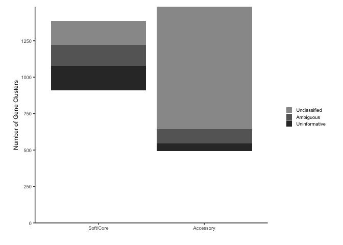
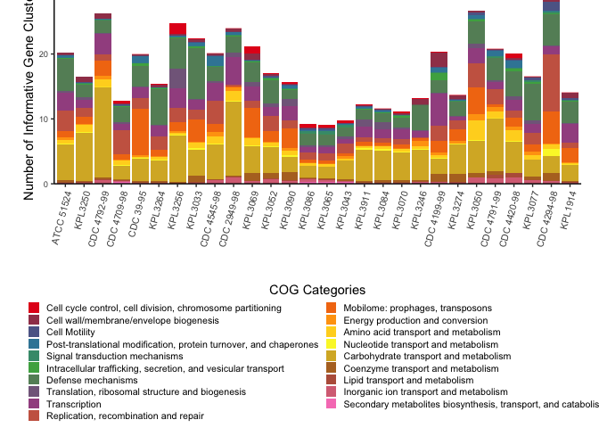
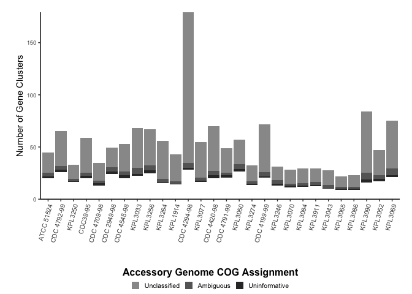
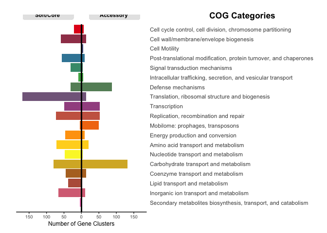
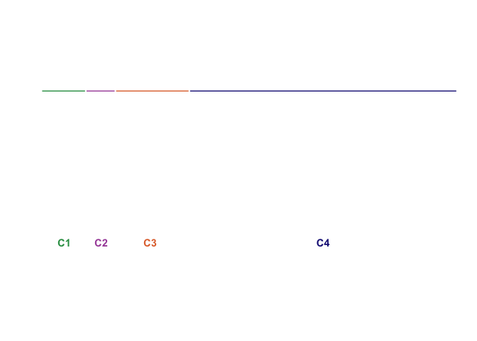

*Dolosigranulum pigrum* COG ANALYSIS
================

## Data Cleaning

We import the output of `anvi-summarize` and select the most relevant
variables for the functional analysis:

``` r
DpigPangenome <- read_csv("Dpi_Prokka_Pan_t28_gene_clusters_summary.csv")
DpigPangenome <- DpigPangenome %>%
  select(unique_id, gene_cluster_id, bin_name, genome_name, num_genomes_gene_cluster_has_hits, num_genes_in_gene_cluster, `Prokka:Prodigal_ACC`, `Prokka:Prodigal`, COG_CATEGORY, COG_FUNCTION, COG_FUNCTION_ACC)
```

New variable “accessory\_vs\_core” where we define “core” as
“MC\_core”+“SC\_core”+“soft\_core” and “accessory” as
“shell”+“cloud”:

``` r
DpigPangenome<-DpigPangenome %>%
  mutate(accessory_vs_core=ifelse(bin_name=="MC_core"|bin_name=="SC_core"|bin_name=="soft_core","Core","Accessory"))
```

The number of genes and proportions of accessory vs. core are:

``` r
nrow(DpigPangenome %>% group_by(gene_cluster_id) %>% filter(accessory_vs_core =="Accessory") %>% summarise)
```

    ## [1] 1483

``` r
nrow(DpigPangenome %>% group_by(gene_cluster_id) %>% filter(accessory_vs_core =="Core") %>% summarise)
```

    ## [1] 1386

``` r
100*nrow(DpigPangenome %>% group_by(gene_cluster_id) %>% filter(accessory_vs_core =="Accessory") %>% summarise)/nrow(DpigPangenome %>% group_by(gene_cluster_id) %>% summarise)
```

    ## [1] 51.69048

``` r
100*nrow(DpigPangenome %>% group_by(gene_cluster_id) %>% filter(accessory_vs_core =="Core") %>% summarise)/nrow(DpigPangenome %>% group_by(gene_cluster_id) %>% summarise)
```

    ## [1] 48.30952

We define a new variable `COGs` to use in the plots. This variable is
based on `COG_CATEGORY` but with a cleaner definition of unclassified,
uninformative or mixed assignments: \* COG categories “Function Unknown”
and “General function predictions only” were considered as
“Uninformative”. \* If the COG category is a mix (for example G|S|M)
it gets labeled like “Ambiguous”. \* Also missing values (NA) are
labeled as Unclassified".

``` r
DpigPangenome$COGs <- DpigPangenome$COG_CATEGORY
DpigPangenome$COGs[DpigPangenome$COGs =="S"]<- "Uninformative"
DpigPangenome$COGs[DpigPangenome$COGs =="R"]<- "Uninformative"
DpigPangenome$COGs[grepl('|', DpigPangenome$COGs,fixed=TRUE)]<-"Ambiguous"
DpigPangenome$COGs[is.na(DpigPangenome$COGs)]<-"Unclassified"
```

### Summary

Summary of GOC annotated genes:

``` r
Summary <- data.frame(
  "Genes" = c("Total in Dpig Pangenome", 
              "COG Category Uninformative = Function Unknown", 
              "COG Category Uninformative = General function predictions only",
              "COG Category Ambiguous (Mixed COG Category)",
              "COG Category Unclassified (Non-assigned)", 
              "Informative COGs (Total - Uninformative, Ambiguous & Unclassified)"),
  "Count" = c(nrow(DpigPangenome), 
              nrow(DpigPangenome %>% filter(COG_CATEGORY =="S")),
              nrow(DpigPangenome %>% filter(COG_CATEGORY =="R")),
              nrow(DpigPangenome %>% filter(COGs =="Ambiguous")),
              nrow(DpigPangenome %>% filter(COGs =="Unclassified")), 
              nrow(DpigPangenome %>% filter(COGs !="Uninformative" & COGs !="Ambiguous" & COGs !="Unclassified"))
              )
)
Summary$Percentage <- round(100*(Summary$Count/49418),2)
```

``` r
kable(Summary)
```

| Genes                                                              | Count | Percentage |
| :----------------------------------------------------------------- | ----: | ---------: |
| Total in Dpig Pangenome                                            | 49418 |     100.00 |
| COG Category Uninformative = Function Unknown                      |  2496 |       5.05 |
| COG Category Uninformative = General function predictions only     |  2733 |       5.53 |
| COG Category Ambiguous (Mixed COG Category)                        |  4883 |       9.88 |
| COG Category Unclassified (Non-assigned)                           |  9333 |      18.89 |
| Informative COGs (Total - Uninformative, Ambiguous & Unclassified) | 29973 |      60.65 |

60.65% of the gene calls are Informative.

## COG analysis corrected by number of genes in each GC

This analysis was done at the pangenomic gene cluster level (GC). Since
many gene clusters had mixed COG category assignments a solution is to
assign each individual gene call to their corresponding
Genome/AccessoryvsCore/COG grouping weighting their contribution by
dividing their count by the number of genes in their GC.

The table “DpigCOGsbyGC” groups the genes by genome; and inside genomes
by accessory vs. core status, and nested inside as the unambiguous COG
category. But, in this case, instead of counting the elements in each
group we calculated the sum of 1/num\_genes\_in\_gene\_cluster.

``` r
DpigCOGsbyGC <-DpigPangenome %>%
  group_by(genome_name, accessory_vs_core, COGs) %>%
    summarise(num_corrected_genes=sum(1/num_genes_in_gene_cluster))
```

The total sum of all values in the `num_corrected_genes` variable should
add up to the number of CGs:

``` r
sum(DpigCOGsbyGC$num_corrected_genes)
```

    ## [1] 2869

``` r
nrow(DpigPangenome %>% group_by(gene_cluster_id) %>% summarise)
```

    ## [1] 2869

Extra column to label the gray scale portion of the plots:

``` r
DpigCOGsbyGC<-DpigCOGsbyGC %>%
  mutate(Assignment=ifelse(COGs!="Uninformative" & COGs!="Ambiguous" & COGs!="Unclassified", " ", COGs))
```

Renaming and ordering factor levels for variables:

``` r
DpigCOGsbyGC$accessory_vs_core <- factor(DpigCOGsbyGC$accessory_vs_core, levels =c("Core", "Accessory"))

DpigCOGsbyGC$COGs <- recode_factor(DpigCOGsbyGC$COGs, "Q"="Secondary metabolites biosynthesis, transport, and catabolism","P"="Inorganic ion transport and metabolism","I"="Lipid transport and metabolism","H"="Coenzyme transport and metabolism","G"="Carbohydrate transport and metabolism","F"="Nucleotide transport and metabolism","E"="Amino acid transport and metabolism","C"="Energy production and conversion","X"="Mobilome: prophages, transposons","L"="Replication, recombination and repair","K"="Transcription","J"="Translation, ribosomal structure and biogenesis","V"="Defense mechanisms","U"="Intracellular trafficking, secretion, and vesicular transport","T"="Signal transduction mechanisms","O"="Post-translational modification, protein turnover, and chaperones","N"="Cell Motility","M"="Cell wall/membrane/envelope biogenesis","D"="Cell cycle control, cell division, chromosome partitioning","Uninformative"="Uninformative","Ambiguous"="Ambiguous","Unclassified"="Unclassified", .ordered = TRUE)

DpigCOGsbyGC$Assignment <- factor(DpigCOGsbyGC$Assignment, levels =c(" ", "Uninformative", "Ambiguous", "Unclassified"))

DpigCOGsbyGC$genome_name <- recode_factor(DpigCOGsbyGC$genome_name, "Dpigrum_ATCC_51524"="ATCC 51524","Dpigrum_KPL1939_CDC4792_99"="CDC 4792-99","Dpigrum_KPL3250"="KPL3250","Dpigrum_KPL1922_CDC39_95"="CDC39-95","Dpigrum_KPL1934_CDC4709_98"="CDC 4709-98","Dpigrum_KPL1930_CDC2949_98"="CDC 2949-98","Dpigrum_KPL1933_CDC4545_98"="CDC 4545-98","Dpigrum_KPL3033"="KPL3033","Dpigrum_KPL3256"="KPL3256","Dpigrum_KPL3264"="KPL3264","Dpigrum_KPL1914"="KPL1914","Dpigrum_KPL1931_CDC4294_98"="CDC 4294-98","Dpigrum_KPL3077"="KPL3077","Dpigrum_KPL1932_CDC4420_98"="CDC 4420-98","Dpigrum_KPL1938_CDC4791_99"="CDC 4791-99","Dpigrum_KPL3050"="KPL3050","Dpigrum_KPL3274"="KPL3274","Dpigrum_KPL1937_CDC4199_99"="CDC 4199-99","Dpigrum_KPL3246"="KPL3246","Dpigrum_KPL3070"="KPL3070","Dpigrum_KPL3084"="KPL3084","Dpigrum_KPL3911"="KPL3911","Dpigrum_KPL3043"="KPL3043","Dpigrum_KPL3065"="KPL3065","Dpigrum_KPL3086"="KPL3086","Dpigrum_KPL3090"="KPL3090","Dpigrum_KPL3052"="KPL3052","Dpigrum_KPL3069"="KPL3069", .ordered = TRUE)
```

Color Palettes

``` r
getPalette <- colorRampPalette(brewer.pal(8, "Set1"))
CountTotalCOGs <- length(unique(DpigCOGsbyGC$COGs))

palette1 <- c("grey60", "grey40", "grey20", getPalette(CountTotalCOGs-3)) # 22 elements: Colors + Grays
palette2 <- getPalette(CountTotalCOGs-3) # 19 elements: Colors
palette3 <- c("grey60", "grey40", "grey20", "white") # 4 elements: White + Grays
```

### Plots Accessory vs. Core

Panel A in main figure:

``` r
pA <- ggplot(DpigCOGsbyGC, aes(x = accessory_vs_core, y = num_corrected_genes, fill = fct_rev(COGs))) +
  stat_summary(fun=sum ,geom="bar", position = "stack") +
  scale_x_discrete(labels = c("Soft/Core", "Accessory")) +
  scale_fill_manual(values = palette1) +
  scale_y_continuous(expand = c(0,0), breaks=seq(0, 1500, by = 250)) +
  labs(fill="COG Categories", x=" ", y= "Number of Gene Clusters") +
  theme_classic() +
  theme(axis.title = element_text(size = 9), axis.text = element_text(size=7), plot.margin=unit(c(10,0,10,20),"pt"), legend.position = "none") 
pA
```

<!-- -->

This plot is used for the grayscale legend:

``` r
pB <- ggplot(DpigCOGsbyGC, aes(x = accessory_vs_core, y = num_corrected_genes, fill = fct_rev(Assignment))) +
  stat_summary(fun=sum ,geom="bar", position = "stack") +
  scale_x_discrete(labels = c("Soft/Core", "Accessory")) +
  scale_fill_manual(values = palette3) +
  scale_y_continuous(expand = c(0,0), breaks=seq(0, 1500, by = 250)) +
  labs(fill=" ", x=" ", y= "Number of Gene Clusters") +
  theme_classic() +
  theme(axis.title = element_text(size = 9), axis.text = element_text(size=7), plot.margin=unit(c(10,0,10,20),"pt"), legend.key.size = unit(0.7, "line"), legend.text = element_text(size = 7), legend.box.margin = margin(10,20,10,10)) +
  guides(fill=guide_legend(ncol=1, title.position = "top", title.hjust = 0.5))
pB
```

<!-- -->

### Plots by Genome

Panel A in supplemental figure:

``` r
pC <- ggplot(filter(DpigCOGsbyGC, accessory_vs_core == "Accessory"), aes(x=genome_name, y=num_corrected_genes, fill = fct_rev(COGs))) +
  stat_summary(fun=sum ,geom="bar", position = "stack") +
  scale_fill_manual(values = palette1) +
  scale_y_continuous(expand = c(0,0)) + 
  labs(fill="COG Assignment", x="", y= "Number of Gene Clusters") +
  theme_classic() + 
  theme(axis.text.y = element_text(size=7), axis.text.x = element_text(size=8, angle=75, hjust=1)) +
  theme(legend.position = "none", plot.margin=unit(c(15,15,-10,20),"pt")) 

pC
```

<!-- -->
Panel B in supplemental figure:

``` r
pD <- ggplot(filter(DpigCOGsbyGC %>% filter(COGs != "Uninformative", COGs !="Ambiguous", COGs != "Unclassified"), accessory_vs_core == "Accessory"), aes(x=genome_name, y=num_corrected_genes, fill = fct_rev(COGs))) +
  stat_summary(fun=sum ,geom="bar", position = "stack") +
  scale_y_continuous(expand = c(0,0)) + 
  scale_fill_manual(values = palette2) + 
  labs(fill="COG Categories", x="", y= "Number of Informative Gene Clusters") +
  theme_classic() + 
  theme(axis.text.y = element_text(size=7), axis.text.x = element_text(size=8, angle=75, hjust=1)) +
  theme(legend.position="bottom", legend.key.size = unit(0.7, "line"), legend.text = element_text(size = 8), plot.margin=unit(c(0,15,0,20),"pt")) +
  guides(fill=guide_legend(ncol=2, title.position = "top", title.hjust = 0.5)) 
pD
```

<!-- -->
This plot is used for the grayscale legend:

``` r
pE <- ggplot(filter(DpigCOGsbyGC, accessory_vs_core == "Accessory"), aes(x=genome_name, y=num_corrected_genes, fill = fct_rev(Assignment))) +
  stat_summary(fun=sum ,geom="bar", position = "stack") +
  scale_fill_manual(values = palette3) +
  scale_y_continuous(expand = c(0,0)) + 
  labs(fill="Accessory Genome COG Assignment", x="", y= "Number of Gene Clusters") +
  theme_classic() + 
  theme(axis.text.y = element_text(size=7), axis.text.x = element_text(size=8, angle=75, hjust=1)) +
  theme(legend.position="bottom", legend.key.size = unit(0.7, "line"), legend.text = element_text(size = 8), legend.title = element_text(face="bold", size = 12), plot.margin=unit(c(15,15,0,20),"pt")) +
  guides(fill=guide_legend(nrow=1, title.position = "top", title.hjust = -5))
pE
```

<!-- -->

### Plots by COG Category

The table “COGTotalGC” groups the genes by accessory vs. core status,
and nested inside as the unambiguous COG category. Table converted to
the wide format.

``` r
COGTotalGC<-DpigPangenome %>%
  group_by(accessory_vs_core, COGs) %>%
  summarise(num_corrected_genes=sum(1/num_genes_in_gene_cluster))

COGTotalGC$COGs <- recode_factor(COGTotalGC$COGs, "Q"="Secondary metabolites biosynthesis, transport, and catabolism","P"="Inorganic ion transport and metabolism","I"="Lipid transport and metabolism","H"="Coenzyme transport and metabolism","G"="Carbohydrate transport and metabolism","F"="Nucleotide transport and metabolism","E"="Amino acid transport and metabolism","C"="Energy production and conversion","X"="Mobilome: prophages, transposons","L"="Replication, recombination and repair","K"="Transcription","J"="Translation, ribosomal structure and biogenesis","V"="Defense mechanisms","U"="Intracellular trafficking, secretion, and vesicular transport","T"="Signal transduction mechanisms","O"="Post-translational modification, protein turnover, and chaperones","N"="Cell Motility","M"="Cell wall/membrane/envelope biogenesis","D"="Cell cycle control, cell division, chromosome partitioning","Uninformative"="Uninformative","Ambiguous"="Ambiguous","Unclassified"="Unclassified", .ordered = TRUE)

COGTotalGC <- spread(COGTotalGC, accessory_vs_core, num_corrected_genes)
```

``` r
A <- round(100*sum(COGTotalGC$Accessory)/(sum(COGTotalGC$Accessory)+sum(COGTotalGC$Core)), 2)
C <- round(100*sum(COGTotalGC$Core)/(sum(COGTotalGC$Accessory)+sum(COGTotalGC$Core)), 2)
```

The proportions are 51.69% accessory vs. 48.31% core at the pangenome
level. We calculate the accessory vs. core proportions by COG category,
to see the COG categories that are enriched in the accessory.

``` r
COGTotalGC$total <- COGTotalGC$Accessory + COGTotalGC$Core
COGTotalGC$p.accessory <- round(100*(COGTotalGC$Accessory/COGTotalGC$total), 2)
COGTotalGC$p.core <- round(100*(COGTotalGC$Core/COGTotalGC$total), 2)
COGTotalGC$enrichment <- round(COGTotalGC$p.accessory/A, 2)
```

``` r
kable(COGTotalGC)
```

| COGs                                                              |  Accessory |       Core |       total | p.accessory | p.core | enrichment |
| :---------------------------------------------------------------- | ---------: | ---------: | ----------: | ----------: | -----: | ---------: |
| Secondary metabolites biosynthesis, transport, and catabolism     |   1.000000 |   5.000000 |    6.000000 |       16.67 |  83.33 |       0.32 |
| Inorganic ion transport and metabolism                            |  10.800000 |  66.005681 |   76.805681 |       14.06 |  85.94 |       0.27 |
| Lipid transport and metabolism                                    |   3.000000 |  37.866725 |   40.866725 |        7.34 |  92.66 |       0.14 |
| Coenzyme transport and metabolism                                 |  12.947368 |  45.620690 |   58.568058 |       22.11 |  77.89 |       0.43 |
| Carbohydrate transport and metabolism                             | 131.777734 |  80.356549 |  212.134283 |       62.12 |  37.88 |       1.20 |
| Nucleotide transport and metabolism                               |   4.000000 |  48.000000 |   52.000000 |        7.69 |  92.31 |       0.15 |
| Amino acid transport and metabolism                               |  20.726708 |  71.911239 |   92.637947 |       22.37 |  77.63 |       0.43 |
| Energy production and conversion                                  |   9.558824 |  46.536946 |   56.095769 |       17.04 |  82.96 |       0.33 |
| Mobilome: prophages, transposons                                  |  50.128275 |   3.964286 |   54.092560 |       92.67 |   7.33 |       1.79 |
| Replication, recombination and repair                             |  53.023809 |  72.476833 |  125.500642 |       42.25 |  57.75 |       0.82 |
| Transcription                                                     |  52.731512 |  49.273876 |  102.005388 |       51.69 |  48.31 |       1.00 |
| Translation, ribosomal structure and biogenesis                   |  13.995556 | 169.455833 |  183.451388 |        7.63 |  92.37 |       0.15 |
| Defense mechanisms                                                |  87.119592 |  31.741032 |  118.860624 |       73.30 |  26.70 |       1.42 |
| Intracellular trafficking, secretion, and vesicular transport     |   5.000000 |   9.000000 |   14.000000 |       35.71 |  64.29 |       0.69 |
| Signal transduction mechanisms                                    |   3.489011 |  31.764325 |   35.253336 |        9.90 |  90.10 |       0.19 |
| Post-translational modification, protein turnover, and chaperones |   9.000000 |  55.933333 |   64.933333 |       13.86 |  86.14 |       0.27 |
| Cell Motility                                                     |   5.274510 |   2.214286 |    7.488796 |       70.43 |  29.57 |       1.36 |
| Cell wall/membrane/envelope biogenesis                            |  12.795215 |  59.637665 |   72.432881 |       17.66 |  82.34 |       0.34 |
| Cell cycle control, cell division, chromosome partitioning        |   6.586538 |  21.524950 |   28.111488 |       23.43 |  76.57 |       0.45 |
| Uninformative                                                     |  50.750681 | 170.845630 |  221.596312 |       22.90 |  77.10 |       0.44 |
| Ambiguous                                                         |  99.053627 | 141.974587 |  241.028214 |       41.10 |  58.90 |       0.80 |
| Unclassified                                                      | 840.241040 | 164.895536 | 1005.136576 |       83.59 |  16.41 |       1.62 |

In order to represent the Core on the left of a plot with absolute
values per COG category we create `core.neg`; a negative version of the
`core` variable in COGTotalGC. Table converted to the long format for
plotting.

``` r
COGTotalGC$core.neg <- -COGTotalGC$Core
COGTotalGCLong <- gather(COGTotalGC, accessory_vs_core, plotting, core.neg, Accessory)
```

``` r
pF <- ggplot(filter(COGTotalGCLong, COGs != "Uninformative", COGs != "Ambiguous", COGs != "Unclassified"), aes(x = COGs, y = plotting, fill = COGs)) +
  geom_bar(stat="identity") + 
  scale_fill_manual(values = rev(palette2)) + 
  scale_x_discrete(position = "top") +
  labs(title= "COG Categories", x="", y= "Number of Gene Clusters") +
  coord_flip() +
  scale_y_continuous(limits = c(-170, 170), breaks = c(-150, -100, -50, 0, 50, 100, 150), label = c(150, 100, 50, 0, 50, 100, 150)) +
  geom_segment(aes(x=0,xend=19.5,y=0,yend=0)) +
  geom_label(aes(x = 20.5, y = -95, label = "      Soft/Core       "), fontface="bold", size=3, fill = "grey90", label.size=NA, label.padding = unit(0.3, "lines")) +
  geom_label(aes(x = 20.5, y = 95, label = "     Accessory      "), fontface="bold", size=3, fill = "grey90", label.size=NA, label.padding = unit(0.3, "lines")) +
  theme_classic() +
  theme(axis.title = element_text(size = 9), axis.text.x = element_text(size=7), axis.ticks.y = element_blank(), axis.line.y = element_blank(), legend.position = "none", plot.margin=unit(c(5,10,10,25),"pt"), plot.title=element_text(face="bold", hjust=3, vjust=-3.9)) 

pF
```

<!-- -->

``` r
gpF <- ggplotGrob(pF)
gpF$layout$clip[gpF$layout$name=="panel"] <- "off"
```

This is used for the clade labels:

``` r
clades <- ggplot() +
  scale_y_continuous(limits = c(-1.5, 0.5), breaks = c(-1, 0)) +
  geom_segment(aes(x=0,xend=2.9,y=0,yend=0), color="#2c9b51ff") +
  geom_segment(aes(x=3,xend=4.9,y=0,yend=0), color="#a851a8ff") +
  geom_segment(aes(x=5,xend=9.9,y=0,yend=0), color="#e17139ff") +
  geom_segment(aes(x=10,xend=28,y=0,yend=0), color="#1b1d86ff") +
  annotate("text", x = 1.5, y = -1, label = "C1", fontface="bold", color="#2c9b51ff")+
  annotate("text", x = 4, y = -1, label = "C2", fontface="bold", color="#a851a8ff")+
  annotate("text", x = 7.3, y = -1, label = "C3", fontface="bold", color="#e17139ff")+
  annotate("text", x = 19, y = -1, label = "C4", fontface="bold", color="#1b1d86ff")+
  theme_classic() +
  theme(axis.title = element_blank(), axis.text = element_blank(), axis.ticks = element_blank(), axis.line = element_blank(), plot.margin=unit(c(0,0,5,20),"pt")) 
clades
```

<!-- -->

## Final Figures

``` r
pMain <- ggarrange(ggarrange(get_legend(pB), pA, ncol = 1, heights = c(0.2, 1)),
                   gpF, ncol = 2, labels = c("A", "B"), hjust=-0.5, vjust=2, widths = c(0.7, 2))

ggsave("IFE2020_0729_FigCOGMain.tiff", pMain, width = 9, height = 4, dpi = 150)
```

``` r
pSupple <- ggarrange(get_legend(pE),
                      ggarrange(pC+theme(axis.text.x = element_blank(), axis.ticks.x = element_blank()), pD+theme(legend.position="none"), ncol = 1,  align = "v", labels = c("A", "B"), hjust=-0.5, vjust=1, heights = c(1, 1)),
                      clades, 
                      get_legend(pD), ncol = 1, heights = c(0.2, 2, 0.2, 0.6))

ggsave("IFE2020_0729_FigCOGSupple.tiff", pSupple, width = 8, height = 10, dpi = 150)
```
