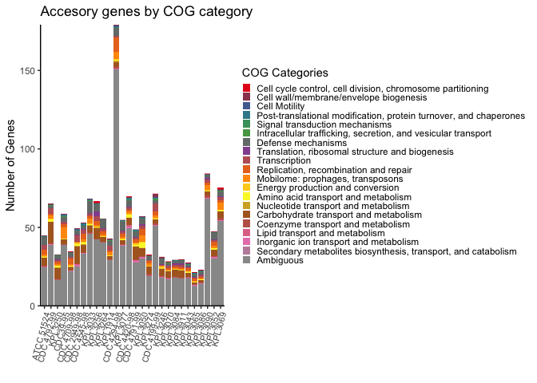
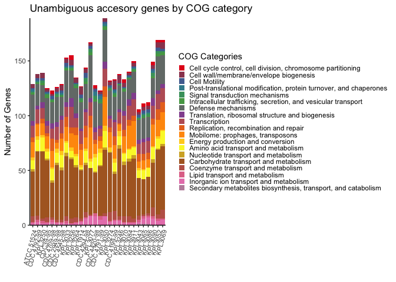
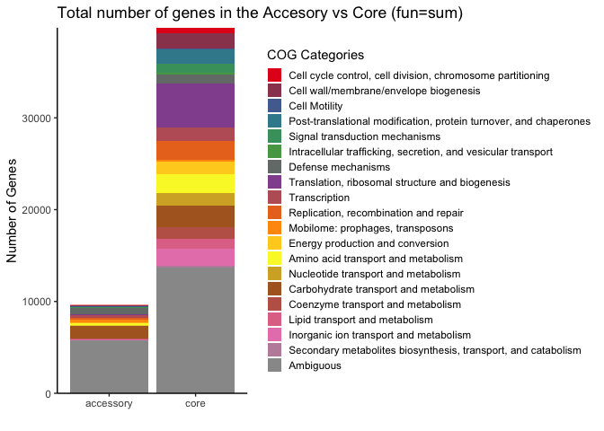
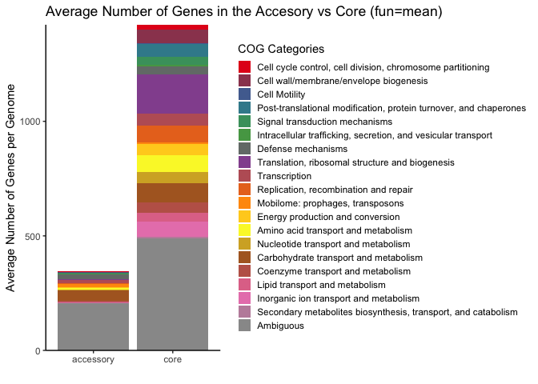
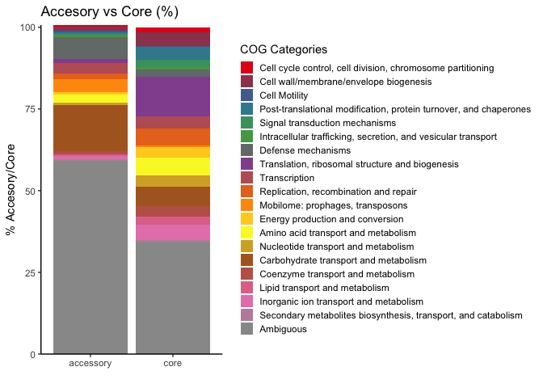
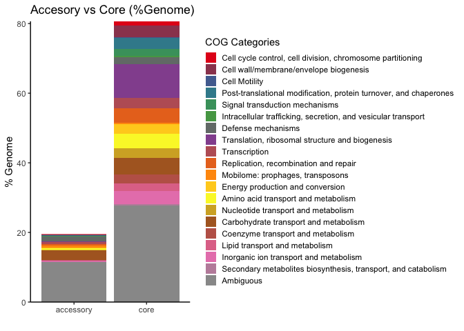
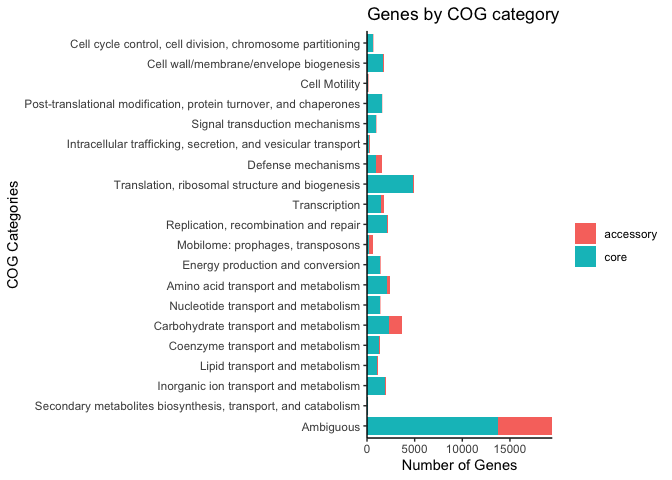

*Dolosigranulum pigrum* COG ANALYSIS
================

## Data Input

We import the output of `anvi-summarize` and select the most relevant
variables for the functional analysis:

``` r
DpigPangenome <- read_csv("Dpi_Prokka_Pan_t28_gene_clusters_summary.csv")
DpigPangenome <- DpigPangenome %>%
  select(unique_id, gene_cluster_id, bin_name, genome_name, num_genomes_gene_cluster_has_hits,`Prokka:Prodigal_ACC`, `Prokka:Prodigal`, COG_CATEGORY, COG_FUNCTION, COG_FUNCTION_ACC)
```

New variable “accessory\_vs\_core” where we define “core” as
“MC\_core”+“SC\_core”+“soft\_core” and “accessory” as
“shell”+“cloud”:

``` r
DpigPangenome<-DpigPangenome %>%
  mutate(accessory_vs_core=ifelse(bin_name=="MC_core"|bin_name=="SC_core"|bin_name=="soft_core","core","accessory"))
```

New variables to identify the ambiguous COG annotations calls, both at
the COG category and COG function levels. \* If the COG\_FUNCTION\_ACC
is ambiguous (for example COG4409|COG4932) it gets labeled like a mix
function (“mixF”). \* If the COG\_CATEGORY is ambiguous (for example
G|S|M) it gets labeled like a mix category (“mixC”). \* Also missing
values are flagged as “NA”.

``` r
DpigPangenome$COG_FUNCTION_CLEAN <- DpigPangenome$COG_FUNCTION_ACC
DpigPangenome$COG_FUNCTION_CLEAN[is.na(DpigPangenome$COG_FUNCTION_ACC)]<-"NA"
DpigPangenome$COG_FUNCTION_CLEAN[grepl('|', DpigPangenome$COG_FUNCTION_ACC,fixed=TRUE)]<-"mixF"

DpigPangenome$COG_CATEGORY_CLEAN <- DpigPangenome$COG_CATEGORY
DpigPangenome$COG_CATEGORY_CLEAN[is.na(DpigPangenome$COG_CATEGORY)]<-"NA"
DpigPangenome$COG_CATEGORY_CLEAN[grepl('|', DpigPangenome$COG_CATEGORY,fixed=TRUE)]<-"mixC"
```

New variable with all the ambiguous calls combined:

``` r
DpigPangenome$UnambiguousCategory <- DpigPangenome$COG_CATEGORY
DpigPangenome$UnambiguousCategory[is.na(DpigPangenome$COG_FUNCTION_ACC)]<- "Ambiguous"
DpigPangenome$UnambiguousCategory[DpigPangenome$COG_CATEGORY_CLEAN =="S"]<- "Ambiguous"
DpigPangenome$UnambiguousCategory[DpigPangenome$COG_CATEGORY_CLEAN =="R"]<- "Ambiguous"
DpigPangenome$UnambiguousCategory[DpigPangenome$COG_CATEGORY_CLEAN =="mixC"]<- "Ambiguous"
```

## Data Summary

Summary of GOC annotated genes:

``` r
Summary <- data.frame(
  "Genes" = c("Total in Dpig Pangenome", 
              "COG Category = Non-assigned", 
              "COG Category = Function Unknown", 
              "COG Category = General function predictions only",
              "COG Category = Mixed",
              "Unambiguous"),
  "Count" = c(nrow(DpigPangenome), 
              nrow(DpigPangenome %>% filter(COG_FUNCTION_CLEAN =="NA")), 
              nrow(DpigPangenome %>% filter(COG_CATEGORY_CLEAN =="S")),
              nrow(DpigPangenome %>% filter(COG_CATEGORY_CLEAN =="R")),
              nrow(DpigPangenome %>% filter(COG_CATEGORY_CLEAN =="mixC")),
              nrow(DpigPangenome %>% filter(UnambiguousCategory !="Ambiguous"))
              )
)
Summary$Percentage <- round(100*(Summary$Count/49418),2)
```

``` r
kable(Summary)
```

| Genes                                            | Count | Percentage |
| :----------------------------------------------- | ----: | ---------: |
| Total in Dpig Pangenome                          | 49418 |     100.00 |
| COG Category = Non-assigned                      |  9333 |      18.89 |
| COG Category = Function Unknown                  |  2496 |       5.05 |
| COG Category = General function predictions only |  2733 |       5.53 |
| COG Category = Mixed                             |  4883 |       9.88 |
| Unambiguous                                      | 29973 |      60.65 |

60.65% of the gene calls are Unambiguous

## COG analysis

This analysis was done at the individual gene level across genomes, not
at the pangenomic gene cluster level, since many gene clusters had mixed
COG category assignments, decreasing even more the pool of unambiguous
calls.

The table “DpigCOGs” groups the genes by genome; and inside genomes by
accessory vs. core status, and nested inside as the unambiguous COG
category. Proportions were calculated for each COG category relative to
each pangenomic bin (Accesory/Core) and also relative to each genome.

``` r
DpigCOGs<-DpigPangenome %>%
  group_by(genome_name, accessory_vs_core, UnambiguousCategory) %>%
    summarise(num_genes=n()) %>%
  group_by(genome_name, accessory_vs_core) %>%
    mutate(num_genes_pangenome_bin=sum(num_genes)) %>%
    mutate(proportion_pangenome_bin=100*(num_genes/num_genes_pangenome_bin)) %>%
  group_by(genome_name) %>%
    mutate(num_genes_genome=sum(num_genes)) %>%
    mutate(proportion_genome=100*(num_genes/num_genes_genome))
```

Defining order of COG categories and Strains

``` r
DpigCOGs$accessory_vs_core <- factor(DpigCOGs$accessory_vs_core)

DpigCOGs$UnambiguousCategory <- factor(DpigCOGs$UnambiguousCategory, levels = c("D","M","N","O","T","U","V","J","K","L","X","C","E","F","G","H","I","P","Q","Ambiguous"))
COGlabels = c("Cell cycle control, cell division, chromosome partitioning","Cell wall/membrane/envelope biogenesis","Cell Motility","Post-translational modification, protein turnover, and chaperones","Signal transduction mechanisms","Intracellular trafficking, secretion, and vesicular transport","Defense mechanisms","Translation, ribosomal structure and biogenesis","Transcription","Replication, recombination and repair","Mobilome: prophages, transposons","Energy production and conversion","Amino acid transport and metabolism","Nucleotide transport and metabolism","Carbohydrate transport and metabolism","Coenzyme transport and metabolism","Lipid transport and metabolism","Inorganic ion transport and metabolism","Secondary metabolites biosynthesis, transport, and catabolism","Ambiguous")

DpigCOGs$genome_name <- factor(DpigCOGs$genome_name, levels = c("Dpigrum_ATCC_51524", "Dpigrum_KPL1939_CDC4792_99","Dpigrum_KPL3250","Dpigrum_KPL1922_CDC39_95","Dpigrum_KPL1934_CDC4709_98","Dpigrum_KPL1930_CDC2949_98","Dpigrum_KPL1933_CDC4545_98","Dpigrum_KPL3033","Dpigrum_KPL3256","Dpigrum_KPL3264","Dpigrum_KPL1914","Dpigrum_KPL1931_CDC4294_98","Dpigrum_KPL3077","Dpigrum_KPL1932_CDC4420_98","Dpigrum_KPL1938_CDC4791_99","Dpigrum_KPL3050","Dpigrum_KPL3274","Dpigrum_KPL1937_CDC4199_99","Dpigrum_KPL3246","Dpigrum_KPL3070","Dpigrum_KPL3084","Dpigrum_KPL3911","Dpigrum_KPL3043","Dpigrum_KPL3065","Dpigrum_KPL3086","Dpigrum_KPL3090","Dpigrum_KPL3052","Dpigrum_KPL3069"))
strainlabels = c("ATCC 51524", "CDC 4792-99","KPL3250","CDC39-95","CDC 4709-98","CDC 2949-98","CDC 4545-98","KPL3033","KPL3256","KPL3264","KPL1914","CDC 4294-98","KPL3077","CDC 4420-98","CDC 4791-99","KPL3050","KPL3274","CDC 4199-99","KPL3246","KPL3070","KPL3084","KPL3911","KPL3043","KPL3065","KPL3086","KPL3090","KPL3052","KPL3069")
```

### COG Plots

``` r
colourCount = length(unique(DpigCOGs$UnambiguousCategory))
getPalette = colorRampPalette(brewer.pal(9, "Set1"))
```

``` r
ggplot(filter(DpigCOGs, accessory_vs_core == "accessory"), aes(x=genome_name, y=num_genes, fill=UnambiguousCategory)) +
  geom_bar(stat="identity") + 
  scale_y_continuous(expand = c(0,0)) + 
  scale_x_discrete(labels = strainlabels) +
  scale_fill_manual(values = getPalette(colourCount), labels=COGlabels) + 
  labs(fill="COG Categories", x="", y= "Number of Genes", title="Accesory genes by COG category") +
  theme_classic() + 
  theme(axis.text.x = element_text(size=8, angle=75, hjust=1)) +
  theme(legend.position="right",legend.key.size = unit(0.3, "cm")) +
  guides(fill=guide_legend(ncol=1, title.position = "top")) 
```

<!-- -->

``` r
ggplot(filter(DpigCOGs %>% filter(UnambiguousCategory !="Ambiguous"), accessory_vs_core == "accessory"), aes(x=genome_name, y=num_genes, fill=UnambiguousCategory)) +
  geom_bar(stat="identity") + 
  scale_y_continuous(expand = c(0,0)) + 
  scale_x_discrete(labels = strainlabels) +
  scale_fill_manual(values = getPalette(colourCount), labels=COGlabels) + 
  labs(fill="COG Categories", x="", y= "Number of Genes", title="Unambiguous accesory genes by COG category") +
  theme_classic() + 
  theme(axis.text.x = element_text(size=8, angle=75, hjust=1)) +
  theme(legend.position="right",legend.key.size = unit(0.3, "cm")) +
  guides(fill=guide_legend(ncol=1, title.position = "top")) 
```

<!-- -->

``` r
ggplot(DpigCOGs, aes(x = accessory_vs_core, y = num_genes, fill = UnambiguousCategory)) +
  stat_summary(fun=sum ,geom="bar", position = "stack") +
  scale_fill_manual(values = getPalette(colourCount), labels=COGlabels) +
  scale_y_continuous(expand = c(0,0)) + 
  labs(fill="COG Categories", x="", y= "Number of Genes", title="Total number of genes in the Accesory vs Core (fun=sum)") +
  theme_classic() +
  theme(legend.key.size = unit(0.45, "cm")) 
```

<!-- -->

``` r
ggplot(DpigCOGs, aes(x = accessory_vs_core, y = num_genes, fill = UnambiguousCategory)) +
  stat_summary(fun=mean ,geom="bar", position = "stack") +
  scale_fill_manual(values = getPalette(colourCount), labels=COGlabels) +
  scale_y_continuous(expand = c(0,0)) + 
  labs(fill="COG Categories", x="", y= "Average Number of Genes per Genome", title="Average Number of Genes in the Accesory vs Core (fun=mean)") +
  theme_classic() +
  theme(legend.key.size = unit(0.45, "cm"))
```

<!-- -->

``` r
ggplot(DpigCOGs, aes(x = accessory_vs_core, y = proportion_pangenome_bin, fill = UnambiguousCategory)) +
  stat_summary(fun=mean, geom="bar", position = "stack") +
  scale_fill_manual(values = getPalette(colourCount), labels=COGlabels) +
  scale_y_continuous(expand = c(0,0)) + 
  labs(fill="COG Categories", x="", y= "% Accesory/Core", title="Accesory vs Core (%)") +
  theme_classic() +
  theme(legend.key.size = unit(0.45, "cm")) 
```

<!-- -->

``` r
ggplot(DpigCOGs, aes(x = accessory_vs_core, y = proportion_genome, fill = UnambiguousCategory)) +
  stat_summary(fun=mean, geom="bar", position = "stack") +
  scale_fill_manual(values = getPalette(colourCount), labels=COGlabels) +
  scale_y_continuous(expand = c(0,0)) + 
  labs(fill="COG Categories", x="", y= "% Genome", title="Accesory vs Core (%Genome)") +
  theme_classic() +
  theme(legend.key.size = unit(0.45, "cm")) 
```

<!-- -->

This plot can be used to evaluate individual COG categories. Substitute
UnambiguousCategory == “X” for the desired COG category.

``` r
ggpaired(filter(DpigCOGs, UnambiguousCategory == "X"), x = "accessory_vs_core", y = "proportion_pangenome_bin", 
         order = c("accessory", "core"),
         ylab = "num_genes", xlab = "accessory_vs_core") +
    theme_classic()
```

``` r
ggplot(DpigCOGs, aes(x = UnambiguousCategory, y = num_genes, fill = accessory_vs_core)) +
  stat_summary(fun=sum ,geom="bar", position = "stack") +
  scale_y_continuous(expand = c(0,0)) + 
  labs(fill="", x="COG Categories", y= "Number of Genes", title="Genes by COG category") +
  scale_x_discrete(labels = rev(COGlabels), limits = rev(levels(DpigCOGs$UnambiguousCategory))) +
  theme_classic() +
  coord_flip()
```

<!-- -->

The table “COGSummary” groups the genes by accessory vs. core status,
and nested inside as the unambiguous COG category. Table converted to
the wide format: “COGSummary\_Table”

``` r
COGSummary<-DpigPangenome %>%
group_by(accessory_vs_core, UnambiguousCategory) %>%
summarise(num_genes=n())

COGSummary$UnambiguousCategory <- factor(COGSummary$UnambiguousCategory, levels = c("D","M","N","O","T","U","V","J","K","L","X","C","E","F","G","H","I","P","Q","Ambiguous"))

COGSummary_Table <- spread(COGSummary, accessory_vs_core, num_genes)
```

``` r
A <- round(100*sum(COGSummary_Table$accessory)/(sum(COGSummary_Table$accessory)+sum(COGSummary_Table$core)), 2)
C <- round(100*sum(COGSummary_Table$core)/(sum(COGSummary_Table$accessory)+sum(COGSummary_Table$core)), 2)
```

The proportions are 19.45% accessory vs. 80.55% core at the pangenome
level. We calculate the accessory vs. core proportions by COG category,
to see the COG categories that are enriched in the accessory.

``` r
COGSummary_Table$total <- COGSummary_Table$accessory + COGSummary_Table$core
COGSummary_Table$p.accessory <- round(100*(COGSummary_Table$accessory/COGSummary_Table$total), 2)
COGSummary_Table$p.core <- round(100*(COGSummary_Table$core/COGSummary_Table$total), 2)
COGSummary_Table$enrichment <- round(COGSummary_Table$p.accessory/A, 2)
```

``` r
kable(COGSummary_Table)
```

| UnambiguousCategory | accessory |  core | total | p.accessory | p.core | enrichment |
| :------------------ | --------: | ----: | ----: | ----------: | -----: | ---------: |
| D                   |        44 |   608 |   652 |        6.75 |  93.25 |       0.35 |
| M                   |       106 |  1686 |  1792 |        5.92 |  94.08 |       0.30 |
| N                   |        55 |    62 |   117 |       47.01 |  52.99 |       2.42 |
| O                   |        29 |  1571 |  1600 |        1.81 |  98.19 |       0.09 |
| T                   |        45 |   930 |   975 |        4.62 |  95.38 |       0.24 |
| U                   |        51 |   252 |   303 |       16.83 |  83.17 |       0.87 |
| V                   |       628 |   958 |  1586 |       39.60 |  60.40 |       2.04 |
| J                   |       115 |  4818 |  4933 |        2.33 |  97.67 |       0.12 |
| K                   |       319 |  1420 |  1739 |       18.34 |  81.66 |       0.94 |
| L                   |       169 |  2057 |  2226 |        7.59 |  92.41 |       0.39 |
| X                   |       378 |   232 |   610 |       61.97 |  38.03 |       3.19 |
| C                   |        70 |  1312 |  1382 |        5.07 |  94.93 |       0.26 |
| E                   |       241 |  2139 |  2380 |       10.13 |  89.87 |       0.52 |
| F                   |        48 |  1350 |  1398 |        3.43 |  96.57 |       0.18 |
| G                   |      1322 |  2347 |  3669 |       36.03 |  63.97 |       1.85 |
| H                   |       105 |  1282 |  1387 |        7.57 |  92.43 |       0.39 |
| I                   |        40 |  1073 |  1113 |        3.59 |  96.41 |       0.18 |
| P                   |       103 |  1864 |  1967 |        5.24 |  94.76 |       0.27 |
| Q                   |         4 |   140 |   144 |        2.78 |  97.22 |       0.14 |
| Ambiguous           |      5739 | 13706 | 19445 |       29.51 |  70.49 |       1.52 |

### COG Statistics

``` r
stat.wilcox<- compare_means(num_genes ~ accessory_vs_core, DpigCOGs, method="wilcox.test", p.adjust="fdr", group.by = "UnambiguousCategory")
stat.wilcox.proportions<- compare_means(proportion_pangenome_bin ~ accessory_vs_core, DpigCOGs, method="wilcox.test", p.adjust="fdr", group.by = "UnambiguousCategory")
stat.wilcox.proportions.genome<- compare_means(proportion_genome ~ accessory_vs_core, DpigCOGs, method="wilcox.test", p.adjust="fdr", group.by = "UnambiguousCategory")
```
