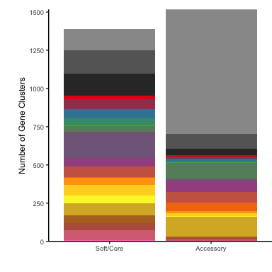
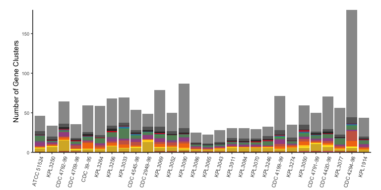
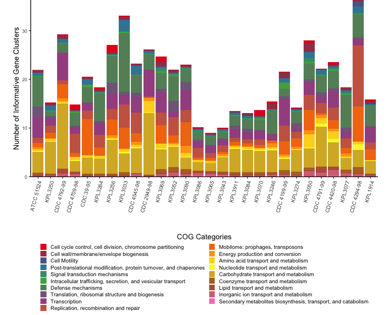
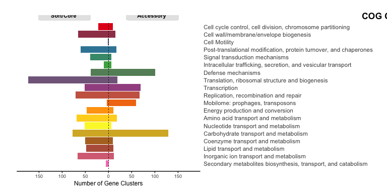
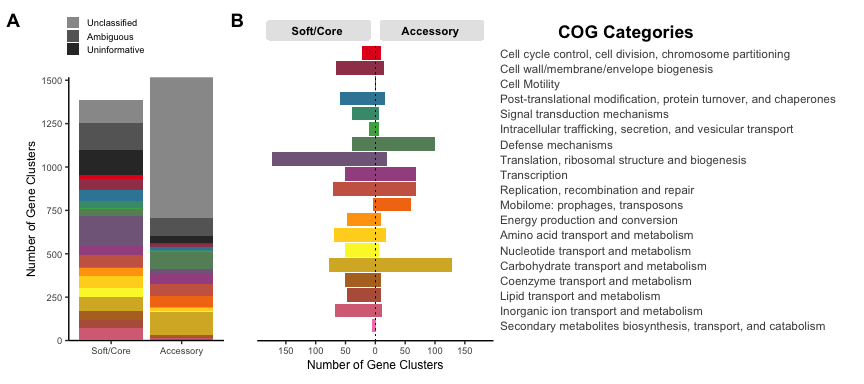
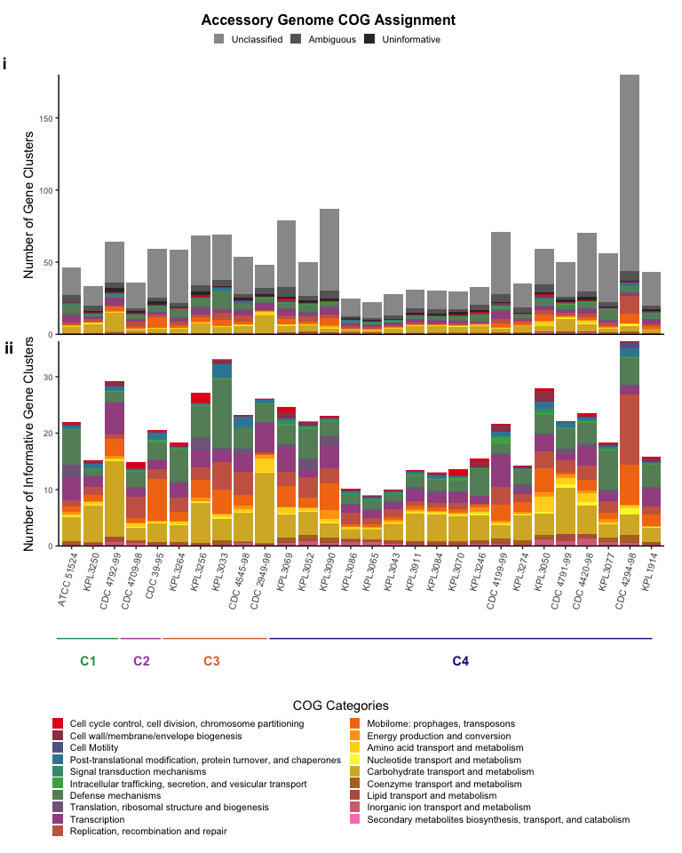

"Genomic Stability and Genetic Defense Systems in *Dolosigranulum
pigrum* a Candidate Beneficial Bacterium from the Human Microbiome"
Supplemental Methods
================

# COG ANALYSIS

## Data Import

We import the output of `anvi-summarize` and select the most relevant
variables for the functional analysis:

``` r
DpigPangenome <- read_delim("analysis_Anvio7/Pangenomic_Results_Dpig/Dpig-PAN-SUMMARY/PAN_DPIG_prokka_gene_clusters_summary.txt.gz", "\t")
DpigPangenome <- DpigPangenome %>%
  select(-functional_homogeneity_index, -geometric_homogeneity_index, -combined_homogeneity_index, -aa_sequence)
```

In the new variable “accessory\_vs\_core” we define “Soft/Core” as
“MC\_core”+“SC\_core”+“soft\_core” and “accessory” as “shell”+“cloud”:

``` r
DpigPangenome <- DpigPangenome %>%
  mutate(accessory_vs_core=ifelse(grepl("Core", bin_name), "Core", "Accessory"))
```

“Core” is used in the code to avoid problems with the “/” symbol and
later replaced with “Soft/Core” for plotting.

There are 1517 gene clusters (GC) (52.2%) in the “Accessory” vs. 1388
(47.8%) in the “Soft/Core” at the pangenome level

## COG Analysis at the Gene Level

We define a new variable `COGs` to use in the plots. This variable is
based on `COG20_CATEGORY` but with a cleaner definition of unclassified,
uninformative, or mixed assignments:

-   COG categories “Function Unknown” and “General function predictions
    only” were considered as “Uninformative”.
-   If the COG category is mix (e.g., G\|S\|M) it gets labeled as
    “Ambiguous”.
-   Missing values (NA) are labeled as “Unclassified”.

``` r
DpigPangenome$COGs <- DpigPangenome$COG20_CATEGORY_ACC
DpigPangenome$COGs[DpigPangenome$COGs =="S"]<- "Uninformative"
DpigPangenome$COGs[DpigPangenome$COGs =="R"]<- "Uninformative"
DpigPangenome$COGs[grepl('|', DpigPangenome$COGs,fixed=TRUE)]<-"Ambiguous"
DpigPangenome$COGs[is.na(DpigPangenome$COGs)]<-"Unclassified"
```

Summary of COG annotated genes:
<table>
<thead>
<tr>
<th style="text-align:left;">
Genes
</th>
<th style="text-align:right;">
Count
</th>
<th style="text-align:right;">
Percentage
</th>
</tr>
</thead>
<tbody>
<tr>
<td style="text-align:left;">
Total in Dpig Pangenome
</td>
<td style="text-align:right;">
49412
</td>
<td style="text-align:right;">
100.0
</td>
</tr>
<tr>
<td style="text-align:left;">
COG Category Uninformative = Function Unknown
</td>
<td style="text-align:right;">
1836
</td>
<td style="text-align:right;">
3.7
</td>
</tr>
<tr>
<td style="text-align:left;">
COG Category Uninformative = General function prediction only
</td>
<td style="text-align:right;">
2612
</td>
<td style="text-align:right;">
5.3
</td>
</tr>
<tr>
<td style="text-align:left;">
COG Category Ambiguous (Mixed COG Category)
</td>
<td style="text-align:right;">
5221
</td>
<td style="text-align:right;">
10.6
</td>
</tr>
<tr>
<td style="text-align:left;">
COG Category Unclassified (Non-assigned)
</td>
<td style="text-align:right;">
8242
</td>
<td style="text-align:right;">
16.7
</td>
</tr>
<tr>
<td style="text-align:left;">
Informative COGs (Total - Uninformative, Ambiguous & Unclassified)
</td>
<td style="text-align:right;">
31501
</td>
<td style="text-align:right;">
63.8
</td>
</tr>
</tbody>
</table>

63.8% of the gene calls are Informative.

## COG Analysis at the Gene Cluster Level

This analysis was done at the pangenomic gene cluster level (GC). Since
many gene clusters had mixed COG category assignments a solution is to
assign each individual gene call to their corresponding
Genome/Accessory\_vs\_Core/COG grouping weighting their contribution by
dividing their count by the number of genes in their GC.

### GCs by COG Category and Genome

The table “GCsbyCOG\_Genome” groups the genes by genome; and inside
genomes by “Accessory” vs. “Soft/Core” status, and nested inside as the
COG category. But, in this case, instead of counting the elements in
each group we calculated the sum of 1/`num_genes_in_gene_cluster`.

``` r
GCsbyCOG_Genome <- DpigPangenome %>%
  group_by(genome_name, accessory_vs_core, COGs) %>%
  summarise(num_corrected_genes=sum(1/num_genes_in_gene_cluster))
```

The total sum of all values in the `num_corrected_genes` variable should
add up to the number of CGs:

``` r
sum(GCsbyCOG_Genome$num_corrected_genes)
```

    ## [1] 2905

``` r
nrow(DpigPangenome %>% group_by(gene_cluster_id) %>% summarise)
```

    ## [1] 2905

Adding extra column to label the gray scale portion of the plots:

``` r
GCsbyCOG_Genome <- GCsbyCOG_Genome %>%
  mutate(Assignment=ifelse(COGs!="Uninformative" & COGs!="Ambiguous" & COGs!="Unclassified", "Informative", COGs))
```

#### Summary of GOC annotated GCs in the Accessory vs. Soft/Core :

``` r
TableGC <- GCsbyCOG_Genome %>% 
  group_by(accessory_vs_core, Assignment) %>%
  summarize(corrected_genes=sum(num_corrected_genes))

TableGC$Percentages <- round(100*TableGC$corrected_genes/sum(TableGC$corrected_genes), 1)

kable(TableGC)
```

<table>
<thead>
<tr>
<th style="text-align:left;">
accessory\_vs\_core
</th>
<th style="text-align:left;">
Assignment
</th>
<th style="text-align:right;">
corrected\_genes
</th>
<th style="text-align:right;">
Percentages
</th>
</tr>
</thead>
<tbody>
<tr>
<td style="text-align:left;">
Accessory
</td>
<td style="text-align:left;">
Ambiguous
</td>
<td style="text-align:right;">
99.93288
</td>
<td style="text-align:right;">
3.4
</td>
</tr>
<tr>
<td style="text-align:left;">
Accessory
</td>
<td style="text-align:left;">
Informative
</td>
<td style="text-align:right;">
564.38923
</td>
<td style="text-align:right;">
19.4
</td>
</tr>
<tr>
<td style="text-align:left;">
Accessory
</td>
<td style="text-align:left;">
Unclassified
</td>
<td style="text-align:right;">
813.73671
</td>
<td style="text-align:right;">
28.0
</td>
</tr>
<tr>
<td style="text-align:left;">
Accessory
</td>
<td style="text-align:left;">
Uninformative
</td>
<td style="text-align:right;">
38.94118
</td>
<td style="text-align:right;">
1.3
</td>
</tr>
<tr>
<td style="text-align:left;">
Core
</td>
<td style="text-align:left;">
Ambiguous
</td>
<td style="text-align:right;">
152.60208
</td>
<td style="text-align:right;">
5.3
</td>
</tr>
<tr>
<td style="text-align:left;">
Core
</td>
<td style="text-align:left;">
Informative
</td>
<td style="text-align:right;">
953.83567
</td>
<td style="text-align:right;">
32.8
</td>
</tr>
<tr>
<td style="text-align:left;">
Core
</td>
<td style="text-align:left;">
Unclassified
</td>
<td style="text-align:right;">
136.83874
</td>
<td style="text-align:right;">
4.7
</td>
</tr>
<tr>
<td style="text-align:left;">
Core
</td>
<td style="text-align:left;">
Uninformative
</td>
<td style="text-align:right;">
144.72351
</td>
<td style="text-align:right;">
5.0
</td>
</tr>
</tbody>
</table>

#### Summary of GOC annotated GCs in the Accessory:

``` r
TableGCAccessory <- GCsbyCOG_Genome %>% 
  filter(accessory_vs_core =="Accessory") %>%
  group_by(accessory_vs_core, Assignment) %>%
  summarize(corrected_genes=sum(num_corrected_genes))

TableGCAccessory$Percentages <- round(100*TableGCAccessory$corrected_genes/sum(TableGCAccessory$corrected_genes), 1)

kable(TableGCAccessory)
```

<table>
<thead>
<tr>
<th style="text-align:left;">
accessory\_vs\_core
</th>
<th style="text-align:left;">
Assignment
</th>
<th style="text-align:right;">
corrected\_genes
</th>
<th style="text-align:right;">
Percentages
</th>
</tr>
</thead>
<tbody>
<tr>
<td style="text-align:left;">
Accessory
</td>
<td style="text-align:left;">
Ambiguous
</td>
<td style="text-align:right;">
99.93288
</td>
<td style="text-align:right;">
6.6
</td>
</tr>
<tr>
<td style="text-align:left;">
Accessory
</td>
<td style="text-align:left;">
Informative
</td>
<td style="text-align:right;">
564.38923
</td>
<td style="text-align:right;">
37.2
</td>
</tr>
<tr>
<td style="text-align:left;">
Accessory
</td>
<td style="text-align:left;">
Unclassified
</td>
<td style="text-align:right;">
813.73671
</td>
<td style="text-align:right;">
53.6
</td>
</tr>
<tr>
<td style="text-align:left;">
Accessory
</td>
<td style="text-align:left;">
Uninformative
</td>
<td style="text-align:right;">
38.94118
</td>
<td style="text-align:right;">
2.6
</td>
</tr>
</tbody>
</table>

#### Summary of GOC annotated GCs in the Soft/Core:

``` r
TableGCCore <- GCsbyCOG_Genome %>% 
  filter(accessory_vs_core =="Core") %>%
  group_by(accessory_vs_core, Assignment) %>%
  summarize(corrected_genes=sum(num_corrected_genes))

TableGCCore$Percentages <- round(100*TableGCCore$corrected_genes/sum(TableGCCore$corrected_genes), 1)

kable(TableGCCore)
```

<table>
<thead>
<tr>
<th style="text-align:left;">
accessory\_vs\_core
</th>
<th style="text-align:left;">
Assignment
</th>
<th style="text-align:right;">
corrected\_genes
</th>
<th style="text-align:right;">
Percentages
</th>
</tr>
</thead>
<tbody>
<tr>
<td style="text-align:left;">
Core
</td>
<td style="text-align:left;">
Ambiguous
</td>
<td style="text-align:right;">
152.6021
</td>
<td style="text-align:right;">
11.0
</td>
</tr>
<tr>
<td style="text-align:left;">
Core
</td>
<td style="text-align:left;">
Informative
</td>
<td style="text-align:right;">
953.8357
</td>
<td style="text-align:right;">
68.7
</td>
</tr>
<tr>
<td style="text-align:left;">
Core
</td>
<td style="text-align:left;">
Unclassified
</td>
<td style="text-align:right;">
136.8387
</td>
<td style="text-align:right;">
9.9
</td>
</tr>
<tr>
<td style="text-align:left;">
Core
</td>
<td style="text-align:left;">
Uninformative
</td>
<td style="text-align:right;">
144.7235
</td>
<td style="text-align:right;">
10.4
</td>
</tr>
</tbody>
</table>

#### Summary of GOC annotated GCs by Genome in the Accessory vs. Soft/Core :

``` r
TableGenomes <- GCsbyCOG_Genome %>% 
  group_by(genome_name, accessory_vs_core) %>% 
  summarize(corrected_genes=sum(num_corrected_genes))

kable(TableGenomes)
```

<table>
<thead>
<tr>
<th style="text-align:left;">
genome\_name
</th>
<th style="text-align:left;">
accessory\_vs\_core
</th>
<th style="text-align:right;">
corrected\_genes
</th>
</tr>
</thead>
<tbody>
<tr>
<td style="text-align:left;">
ATCC\_51524
</td>
<td style="text-align:left;">
Accessory
</td>
<td style="text-align:right;">
46.29627
</td>
</tr>
<tr>
<td style="text-align:left;">
ATCC\_51524
</td>
<td style="text-align:left;">
Core
</td>
<td style="text-align:right;">
49.27065
</td>
</tr>
<tr>
<td style="text-align:left;">
KPL1914
</td>
<td style="text-align:left;">
Accessory
</td>
<td style="text-align:right;">
43.47446
</td>
</tr>
<tr>
<td style="text-align:left;">
KPL1914
</td>
<td style="text-align:left;">
Core
</td>
<td style="text-align:right;">
49.58400
</td>
</tr>
<tr>
<td style="text-align:left;">
KPL1922\_CDC39\_95
</td>
<td style="text-align:left;">
Accessory
</td>
<td style="text-align:right;">
59.26296
</td>
</tr>
<tr>
<td style="text-align:left;">
KPL1922\_CDC39\_95
</td>
<td style="text-align:left;">
Core
</td>
<td style="text-align:right;">
49.24923
</td>
</tr>
<tr>
<td style="text-align:left;">
KPL1930\_CDC2949\_98
</td>
<td style="text-align:left;">
Accessory
</td>
<td style="text-align:right;">
48.40225
</td>
</tr>
<tr>
<td style="text-align:left;">
KPL1930\_CDC2949\_98
</td>
<td style="text-align:left;">
Core
</td>
<td style="text-align:right;">
49.10233
</td>
</tr>
<tr>
<td style="text-align:left;">
KPL1931\_CDC4294\_98
</td>
<td style="text-align:left;">
Accessory
</td>
<td style="text-align:right;">
180.01137
</td>
</tr>
<tr>
<td style="text-align:left;">
KPL1931\_CDC4294\_98
</td>
<td style="text-align:left;">
Core
</td>
<td style="text-align:right;">
49.22567
</td>
</tr>
<tr>
<td style="text-align:left;">
KPL1932\_CDC4420\_98
</td>
<td style="text-align:left;">
Accessory
</td>
<td style="text-align:right;">
70.59157
</td>
</tr>
<tr>
<td style="text-align:left;">
KPL1932\_CDC4420\_98
</td>
<td style="text-align:left;">
Core
</td>
<td style="text-align:right;">
49.44939
</td>
</tr>
<tr>
<td style="text-align:left;">
KPL1933\_CDC4545\_98
</td>
<td style="text-align:left;">
Accessory
</td>
<td style="text-align:right;">
53.97631
</td>
</tr>
<tr>
<td style="text-align:left;">
KPL1933\_CDC4545\_98
</td>
<td style="text-align:left;">
Core
</td>
<td style="text-align:right;">
49.19374
</td>
</tr>
<tr>
<td style="text-align:left;">
KPL1934\_CDC4709\_98
</td>
<td style="text-align:left;">
Accessory
</td>
<td style="text-align:right;">
35.74474
</td>
</tr>
<tr>
<td style="text-align:left;">
KPL1934\_CDC4709\_98
</td>
<td style="text-align:left;">
Core
</td>
<td style="text-align:right;">
50.83189
</td>
</tr>
<tr>
<td style="text-align:left;">
KPL1937\_CDC4199\_99
</td>
<td style="text-align:left;">
Accessory
</td>
<td style="text-align:right;">
71.05543
</td>
</tr>
<tr>
<td style="text-align:left;">
KPL1937\_CDC4199\_99
</td>
<td style="text-align:left;">
Core
</td>
<td style="text-align:right;">
48.70286
</td>
</tr>
<tr>
<td style="text-align:left;">
KPL1938\_CDC4791\_99
</td>
<td style="text-align:left;">
Accessory
</td>
<td style="text-align:right;">
50.05558
</td>
</tr>
<tr>
<td style="text-align:left;">
KPL1938\_CDC4791\_99
</td>
<td style="text-align:left;">
Core
</td>
<td style="text-align:right;">
49.16113
</td>
</tr>
<tr>
<td style="text-align:left;">
KPL1939\_CDC4792\_99
</td>
<td style="text-align:left;">
Accessory
</td>
<td style="text-align:right;">
64.41147
</td>
</tr>
<tr>
<td style="text-align:left;">
KPL1939\_CDC4792\_99
</td>
<td style="text-align:left;">
Core
</td>
<td style="text-align:right;">
49.42569
</td>
</tr>
<tr>
<td style="text-align:left;">
KPL3033
</td>
<td style="text-align:left;">
Accessory
</td>
<td style="text-align:right;">
69.20019
</td>
</tr>
<tr>
<td style="text-align:left;">
KPL3033
</td>
<td style="text-align:left;">
Core
</td>
<td style="text-align:right;">
49.42526
</td>
</tr>
<tr>
<td style="text-align:left;">
KPL3043
</td>
<td style="text-align:left;">
Accessory
</td>
<td style="text-align:right;">
27.87405
</td>
</tr>
<tr>
<td style="text-align:left;">
KPL3043
</td>
<td style="text-align:left;">
Core
</td>
<td style="text-align:right;">
49.54061
</td>
</tr>
<tr>
<td style="text-align:left;">
KPL3050
</td>
<td style="text-align:left;">
Accessory
</td>
<td style="text-align:right;">
59.40550
</td>
</tr>
<tr>
<td style="text-align:left;">
KPL3050
</td>
<td style="text-align:left;">
Core
</td>
<td style="text-align:right;">
49.81297
</td>
</tr>
<tr>
<td style="text-align:left;">
KPL3052
</td>
<td style="text-align:left;">
Accessory
</td>
<td style="text-align:right;">
49.77602
</td>
</tr>
<tr>
<td style="text-align:left;">
KPL3052
</td>
<td style="text-align:left;">
Core
</td>
<td style="text-align:right;">
49.84934
</td>
</tr>
<tr>
<td style="text-align:left;">
KPL3065
</td>
<td style="text-align:left;">
Accessory
</td>
<td style="text-align:right;">
22.44514
</td>
</tr>
<tr>
<td style="text-align:left;">
KPL3065
</td>
<td style="text-align:left;">
Core
</td>
<td style="text-align:right;">
49.67915
</td>
</tr>
<tr>
<td style="text-align:left;">
KPL3069
</td>
<td style="text-align:left;">
Accessory
</td>
<td style="text-align:right;">
78.69686
</td>
</tr>
<tr>
<td style="text-align:left;">
KPL3069
</td>
<td style="text-align:left;">
Core
</td>
<td style="text-align:right;">
49.98896
</td>
</tr>
<tr>
<td style="text-align:left;">
KPL3070
</td>
<td style="text-align:left;">
Accessory
</td>
<td style="text-align:right;">
29.42044
</td>
</tr>
<tr>
<td style="text-align:left;">
KPL3070
</td>
<td style="text-align:left;">
Core
</td>
<td style="text-align:right;">
49.95113
</td>
</tr>
<tr>
<td style="text-align:left;">
KPL3077
</td>
<td style="text-align:left;">
Accessory
</td>
<td style="text-align:right;">
55.95207
</td>
</tr>
<tr>
<td style="text-align:left;">
KPL3077
</td>
<td style="text-align:left;">
Core
</td>
<td style="text-align:right;">
49.61833
</td>
</tr>
<tr>
<td style="text-align:left;">
KPL3084
</td>
<td style="text-align:left;">
Accessory
</td>
<td style="text-align:right;">
30.57503
</td>
</tr>
<tr>
<td style="text-align:left;">
KPL3084
</td>
<td style="text-align:left;">
Core
</td>
<td style="text-align:right;">
49.82250
</td>
</tr>
<tr>
<td style="text-align:left;">
KPL3086
</td>
<td style="text-align:left;">
Accessory
</td>
<td style="text-align:right;">
24.76267
</td>
</tr>
<tr>
<td style="text-align:left;">
KPL3086
</td>
<td style="text-align:left;">
Core
</td>
<td style="text-align:right;">
49.87473
</td>
</tr>
<tr>
<td style="text-align:left;">
KPL3090
</td>
<td style="text-align:left;">
Accessory
</td>
<td style="text-align:right;">
86.89187
</td>
</tr>
<tr>
<td style="text-align:left;">
KPL3090
</td>
<td style="text-align:left;">
Core
</td>
<td style="text-align:right;">
49.81526
</td>
</tr>
<tr>
<td style="text-align:left;">
KPL3246
</td>
<td style="text-align:left;">
Accessory
</td>
<td style="text-align:right;">
32.60655
</td>
</tr>
<tr>
<td style="text-align:left;">
KPL3246
</td>
<td style="text-align:left;">
Core
</td>
<td style="text-align:right;">
49.59801
</td>
</tr>
<tr>
<td style="text-align:left;">
KPL3250
</td>
<td style="text-align:left;">
Accessory
</td>
<td style="text-align:right;">
33.62503
</td>
</tr>
<tr>
<td style="text-align:left;">
KPL3250
</td>
<td style="text-align:left;">
Core
</td>
<td style="text-align:right;">
49.59557
</td>
</tr>
<tr>
<td style="text-align:left;">
KPL3256
</td>
<td style="text-align:left;">
Accessory
</td>
<td style="text-align:right;">
68.20221
</td>
</tr>
<tr>
<td style="text-align:left;">
KPL3256
</td>
<td style="text-align:left;">
Core
</td>
<td style="text-align:right;">
49.36307
</td>
</tr>
<tr>
<td style="text-align:left;">
KPL3264
</td>
<td style="text-align:left;">
Accessory
</td>
<td style="text-align:right;">
58.50242
</td>
</tr>
<tr>
<td style="text-align:left;">
KPL3264
</td>
<td style="text-align:left;">
Core
</td>
<td style="text-align:right;">
49.71041
</td>
</tr>
<tr>
<td style="text-align:left;">
KPL3274
</td>
<td style="text-align:left;">
Accessory
</td>
<td style="text-align:right;">
35.05708
</td>
</tr>
<tr>
<td style="text-align:left;">
KPL3274
</td>
<td style="text-align:left;">
Core
</td>
<td style="text-align:right;">
49.19324
</td>
</tr>
<tr>
<td style="text-align:left;">
KPL3911
</td>
<td style="text-align:left;">
Accessory
</td>
<td style="text-align:right;">
30.72446
</td>
</tr>
<tr>
<td style="text-align:left;">
KPL3911
</td>
<td style="text-align:left;">
Core
</td>
<td style="text-align:right;">
49.96489
</td>
</tr>
</tbody>
</table>

#### Renaming and ordering variables factor levels for plotting:

``` r
GCsbyCOG_Genome$accessory_vs_core <- factor(GCsbyCOG_Genome$accessory_vs_core, levels =c("Core", "Accessory"))

GCsbyCOG_Genome$COGs <- recode_factor(GCsbyCOG_Genome$COGs, "Q"="Secondary metabolites biosynthesis, transport, and catabolism","P"="Inorganic ion transport and metabolism","I"="Lipid transport and metabolism","H"="Coenzyme transport and metabolism","G"="Carbohydrate transport and metabolism","F"="Nucleotide transport and metabolism","E"="Amino acid transport and metabolism","C"="Energy production and conversion","X"="Mobilome: prophages, transposons","L"="Replication, recombination and repair","K"="Transcription","J"="Translation, ribosomal structure and biogenesis","V"="Defense mechanisms","U"="Intracellular trafficking, secretion, and vesicular transport","T"="Signal transduction mechanisms","O"="Post-translational modification, protein turnover, and chaperones","N"="Cell Motility","M"="Cell wall/membrane/envelope biogenesis","D"="Cell cycle control, cell division, chromosome partitioning","Uninformative"="Uninformative","Ambiguous"="Ambiguous","Unclassified"="Unclassified", .ordered = TRUE)

GCsbyCOG_Genome$Assignment <- recode_factor(GCsbyCOG_Genome$Assignment,  "Informative"=" ", "Uninformative"="Uninformative", "Ambiguous"="Ambiguous", "Unclassified"="Unclassified", .ordered = TRUE)

GCsbyCOG_Genome$genome_name <- recode_factor(GCsbyCOG_Genome$genome_name, "ATCC_51524"="ATCC 51524", "KPL3250"="KPL3250", "KPL1939_CDC4792_99"="CDC 4792-99","KPL1934_CDC4709_98"="CDC 4709-98", "KPL1922_CDC39_95"="CDC 39-95", "KPL3264"="KPL3264", "KPL3256"="KPL3256", "KPL3033"="KPL3033", "KPL1933_CDC4545_98"="CDC 4545-98", "KPL1930_CDC2949_98"="CDC 2949-98", "KPL3069"="KPL3069", "KPL3052"="KPL3052", "KPL3090"="KPL3090", "KPL3086"="KPL3086", "KPL3065"="KPL3065", "KPL3043"="KPL3043", "KPL3911"="KPL3911", "KPL3084"="KPL3084", "KPL3070"="KPL3070",
"KPL3246"="KPL3246", "KPL1937_CDC4199_99"="CDC 4199-99","KPL3274"="KPL3274","KPL3050"="KPL3050","KPL1938_CDC4791_99"="CDC 4791-99", "KPL1932_CDC4420_98"="CDC 4420-98", "KPL3077"="KPL3077", "KPL1931_CDC4294_98"="CDC 4294-98", "KPL1914"="KPL1914", .ordered = TRUE)
```

### GCs by COG Category

The table “GCsbyCOG” groups the genes by “Accessory” vs. “Soft/Core”
status, and nested inside as the COG category.

``` r
GCsbyCOG <- DpigPangenome %>%
  group_by(accessory_vs_core, COGs) %>%
  summarise(num_corrected_genes=sum(1/num_genes_in_gene_cluster))
```

#### Renaming and ordering variables factor levels for plotting:

``` r
GCsbyCOG$COGs <- recode_factor(GCsbyCOG$COGs, "Q"="Secondary metabolites biosynthesis, transport, and catabolism",
                               "P"="Inorganic ion transport and metabolism",
                               "I"="Lipid transport and metabolism",
                               "H"="Coenzyme transport and metabolism",
                               "G"="Carbohydrate transport and metabolism",
                               "F"="Nucleotide transport and metabolism",
                               "E"="Amino acid transport and metabolism",
                               "C"="Energy production and conversion",
                               "X"="Mobilome: prophages, transposons",
                               "L"="Replication, recombination and repair",
                               "K"="Transcription",
                               "J"="Translation, ribosomal structure and biogenesis",
                               "V"="Defense mechanisms",
                               "U"="Intracellular trafficking, secretion, and vesicular transport",
                               "T"="Signal transduction mechanisms",
                               "O"="Post-translational modification, protein turnover, and chaperones",
                               "N"="Cell Motility",
                               "M"="Cell wall/membrane/envelope biogenesis",
                               "D"="Cell cycle control, cell division, chromosome partitioning",
                               "Uninformative"="Uninformative",
                               "Ambiguous"="Ambiguous",
                               "Unclassified"="Unclassified", .ordered = TRUE)
```

#### Summary of GOC annotated GCs GCs by COG Category:

New table “GCsbyCOG\_CorevsAcc” in wide format. % of each category
relative to the “Accessory” or “Soft/Core” was calculated (pTotal.
variables). Total GCs for each COG category calculated, and % of GCs in
the “Accessory” and “Soft/Core” relative to each category (p. values)
were calculated as well. The ratio between the number of GC in the
“Accessory” vs. the “Soft/Core” is calculated for each COG:

``` r
GCsbyCOG_CorevsAcc <- spread(GCsbyCOG, accessory_vs_core, num_corrected_genes)
GCsbyCOG_CorevsAcc$pTotal.Accessory <- round(100*GCsbyCOG_CorevsAcc$Accessory/sum(GCsbyCOG_CorevsAcc$Accessory), 1)
GCsbyCOG_CorevsAcc$pTotal.Core <- round(100*GCsbyCOG_CorevsAcc$Core/sum(GCsbyCOG_CorevsAcc$Core), 1)
GCsbyCOG_CorevsAcc$total <- GCsbyCOG_CorevsAcc$Accessory + GCsbyCOG_CorevsAcc$Core
GCsbyCOG_CorevsAcc$pTotal.total <- round(100*GCsbyCOG_CorevsAcc$total/sum(GCsbyCOG_CorevsAcc$total), 1)
GCsbyCOG_CorevsAcc$p.accessory <- round(100*(GCsbyCOG_CorevsAcc$Accessory/GCsbyCOG_CorevsAcc$total), 1)
GCsbyCOG_CorevsAcc$p.core <- round(100*(GCsbyCOG_CorevsAcc$Core/GCsbyCOG_CorevsAcc$total), 1)
GCsbyCOG_CorevsAcc$ratio <- round(GCsbyCOG_CorevsAcc$Accessory/GCsbyCOG_CorevsAcc$Core, 2)

kable(GCsbyCOG_CorevsAcc)
```

<table>
<thead>
<tr>
<th style="text-align:left;">
COGs
</th>
<th style="text-align:right;">
Accessory
</th>
<th style="text-align:right;">
Core
</th>
<th style="text-align:right;">
pTotal.Accessory
</th>
<th style="text-align:right;">
pTotal.Core
</th>
<th style="text-align:right;">
total
</th>
<th style="text-align:right;">
pTotal.total
</th>
<th style="text-align:right;">
p.accessory
</th>
<th style="text-align:right;">
p.core
</th>
<th style="text-align:right;">
ratio
</th>
</tr>
</thead>
<tbody>
<tr>
<td style="text-align:left;">
Secondary metabolites biosynthesis, transport, and catabolism
</td>
<td style="text-align:right;">
1.250000
</td>
<td style="text-align:right;">
6.00000
</td>
<td style="text-align:right;">
0.1
</td>
<td style="text-align:right;">
0.4
</td>
<td style="text-align:right;">
7.25000
</td>
<td style="text-align:right;">
0.2
</td>
<td style="text-align:right;">
17.2
</td>
<td style="text-align:right;">
82.8
</td>
<td style="text-align:right;">
0.21
</td>
</tr>
<tr>
<td style="text-align:left;">
Inorganic ion transport and metabolism
</td>
<td style="text-align:right;">
11.800000
</td>
<td style="text-align:right;">
66.96774
</td>
<td style="text-align:right;">
0.8
</td>
<td style="text-align:right;">
4.8
</td>
<td style="text-align:right;">
78.76774
</td>
<td style="text-align:right;">
2.7
</td>
<td style="text-align:right;">
15.0
</td>
<td style="text-align:right;">
85.0
</td>
<td style="text-align:right;">
0.18
</td>
</tr>
<tr>
<td style="text-align:left;">
Lipid transport and metabolism
</td>
<td style="text-align:right;">
10.000000
</td>
<td style="text-align:right;">
47.90244
</td>
<td style="text-align:right;">
0.7
</td>
<td style="text-align:right;">
3.5
</td>
<td style="text-align:right;">
57.90244
</td>
<td style="text-align:right;">
2.0
</td>
<td style="text-align:right;">
17.3
</td>
<td style="text-align:right;">
82.7
</td>
<td style="text-align:right;">
0.21
</td>
</tr>
<tr>
<td style="text-align:left;">
Coenzyme transport and metabolism
</td>
<td style="text-align:right;">
9.947368
</td>
<td style="text-align:right;">
50.72414
</td>
<td style="text-align:right;">
0.7
</td>
<td style="text-align:right;">
3.7
</td>
<td style="text-align:right;">
60.67151
</td>
<td style="text-align:right;">
2.1
</td>
<td style="text-align:right;">
16.4
</td>
<td style="text-align:right;">
83.6
</td>
<td style="text-align:right;">
0.20
</td>
</tr>
<tr>
<td style="text-align:left;">
Carbohydrate transport and metabolism
</td>
<td style="text-align:right;">
128.706548
</td>
<td style="text-align:right;">
77.67203
</td>
<td style="text-align:right;">
8.5
</td>
<td style="text-align:right;">
5.6
</td>
<td style="text-align:right;">
206.37858
</td>
<td style="text-align:right;">
7.1
</td>
<td style="text-align:right;">
62.4
</td>
<td style="text-align:right;">
37.6
</td>
<td style="text-align:right;">
1.66
</td>
</tr>
<tr>
<td style="text-align:left;">
Nucleotide transport and metabolism
</td>
<td style="text-align:right;">
6.000000
</td>
<td style="text-align:right;">
50.96429
</td>
<td style="text-align:right;">
0.4
</td>
<td style="text-align:right;">
3.7
</td>
<td style="text-align:right;">
56.96429
</td>
<td style="text-align:right;">
2.0
</td>
<td style="text-align:right;">
10.5
</td>
<td style="text-align:right;">
89.5
</td>
<td style="text-align:right;">
0.12
</td>
</tr>
<tr>
<td style="text-align:left;">
Amino acid transport and metabolism
</td>
<td style="text-align:right;">
17.869565
</td>
<td style="text-align:right;">
68.98276
</td>
<td style="text-align:right;">
1.2
</td>
<td style="text-align:right;">
5.0
</td>
<td style="text-align:right;">
86.85232
</td>
<td style="text-align:right;">
3.0
</td>
<td style="text-align:right;">
20.6
</td>
<td style="text-align:right;">
79.4
</td>
<td style="text-align:right;">
0.26
</td>
</tr>
<tr>
<td style="text-align:left;">
Energy production and conversion
</td>
<td style="text-align:right;">
10.267418
</td>
<td style="text-align:right;">
47.00000
</td>
<td style="text-align:right;">
0.7
</td>
<td style="text-align:right;">
3.4
</td>
<td style="text-align:right;">
57.26742
</td>
<td style="text-align:right;">
2.0
</td>
<td style="text-align:right;">
17.9
</td>
<td style="text-align:right;">
82.1
</td>
<td style="text-align:right;">
0.22
</td>
</tr>
<tr>
<td style="text-align:left;">
Mobilome: prophages, transposons
</td>
<td style="text-align:right;">
59.500668
</td>
<td style="text-align:right;">
4.00000
</td>
<td style="text-align:right;">
3.9
</td>
<td style="text-align:right;">
0.3
</td>
<td style="text-align:right;">
63.50067
</td>
<td style="text-align:right;">
2.2
</td>
<td style="text-align:right;">
93.7
</td>
<td style="text-align:right;">
6.3
</td>
<td style="text-align:right;">
14.88
</td>
</tr>
<tr>
<td style="text-align:left;">
Replication, recombination and repair
</td>
<td style="text-align:right;">
67.564286
</td>
<td style="text-align:right;">
71.47683
</td>
<td style="text-align:right;">
4.5
</td>
<td style="text-align:right;">
5.1
</td>
<td style="text-align:right;">
139.04112
</td>
<td style="text-align:right;">
4.8
</td>
<td style="text-align:right;">
48.6
</td>
<td style="text-align:right;">
51.4
</td>
<td style="text-align:right;">
0.95
</td>
</tr>
<tr>
<td style="text-align:left;">
Transcription
</td>
<td style="text-align:right;">
68.913691
</td>
<td style="text-align:right;">
51.49091
</td>
<td style="text-align:right;">
4.5
</td>
<td style="text-align:right;">
3.7
</td>
<td style="text-align:right;">
120.40460
</td>
<td style="text-align:right;">
4.1
</td>
<td style="text-align:right;">
57.2
</td>
<td style="text-align:right;">
42.8
</td>
<td style="text-align:right;">
1.34
</td>
</tr>
<tr>
<td style="text-align:left;">
Translation, ribosomal structure and biogenesis
</td>
<td style="text-align:right;">
19.325092
</td>
<td style="text-align:right;">
173.43889
</td>
<td style="text-align:right;">
1.3
</td>
<td style="text-align:right;">
12.5
</td>
<td style="text-align:right;">
192.76399
</td>
<td style="text-align:right;">
6.6
</td>
<td style="text-align:right;">
10.0
</td>
<td style="text-align:right;">
90.0
</td>
<td style="text-align:right;">
0.11
</td>
</tr>
<tr>
<td style="text-align:left;">
Defense mechanisms
</td>
<td style="text-align:right;">
100.359773
</td>
<td style="text-align:right;">
38.55364
</td>
<td style="text-align:right;">
6.6
</td>
<td style="text-align:right;">
2.8
</td>
<td style="text-align:right;">
138.91342
</td>
<td style="text-align:right;">
4.8
</td>
<td style="text-align:right;">
72.2
</td>
<td style="text-align:right;">
27.8
</td>
<td style="text-align:right;">
2.60
</td>
</tr>
<tr>
<td style="text-align:left;">
Intracellular trafficking, secretion, and vesicular transport
</td>
<td style="text-align:right;">
6.000000
</td>
<td style="text-align:right;">
10.00000
</td>
<td style="text-align:right;">
0.4
</td>
<td style="text-align:right;">
0.7
</td>
<td style="text-align:right;">
16.00000
</td>
<td style="text-align:right;">
0.6
</td>
<td style="text-align:right;">
37.5
</td>
<td style="text-align:right;">
62.5
</td>
<td style="text-align:right;">
0.60
</td>
</tr>
<tr>
<td style="text-align:left;">
Signal transduction mechanisms
</td>
<td style="text-align:right;">
5.642857
</td>
<td style="text-align:right;">
39.93103
</td>
<td style="text-align:right;">
0.4
</td>
<td style="text-align:right;">
2.9
</td>
<td style="text-align:right;">
45.57389
</td>
<td style="text-align:right;">
1.6
</td>
<td style="text-align:right;">
12.4
</td>
<td style="text-align:right;">
87.6
</td>
<td style="text-align:right;">
0.14
</td>
</tr>
<tr>
<td style="text-align:left;">
Post-translational modification, protein turnover, and chaperones
</td>
<td style="text-align:right;">
16.836538
</td>
<td style="text-align:right;">
59.96667
</td>
<td style="text-align:right;">
1.1
</td>
<td style="text-align:right;">
4.3
</td>
<td style="text-align:right;">
76.80321
</td>
<td style="text-align:right;">
2.6
</td>
<td style="text-align:right;">
21.9
</td>
<td style="text-align:right;">
78.1
</td>
<td style="text-align:right;">
0.28
</td>
</tr>
<tr>
<td style="text-align:left;">
Cell Motility
</td>
<td style="text-align:right;">
1.000000
</td>
<td style="text-align:right;">
1.00000
</td>
<td style="text-align:right;">
0.1
</td>
<td style="text-align:right;">
0.1
</td>
<td style="text-align:right;">
2.00000
</td>
<td style="text-align:right;">
0.1
</td>
<td style="text-align:right;">
50.0
</td>
<td style="text-align:right;">
50.0
</td>
<td style="text-align:right;">
1.00
</td>
</tr>
<tr>
<td style="text-align:left;">
Cell wall/membrane/envelope biogenesis
</td>
<td style="text-align:right;">
14.322094
</td>
<td style="text-align:right;">
65.79878
</td>
<td style="text-align:right;">
0.9
</td>
<td style="text-align:right;">
4.7
</td>
<td style="text-align:right;">
80.12087
</td>
<td style="text-align:right;">
2.8
</td>
<td style="text-align:right;">
17.9
</td>
<td style="text-align:right;">
82.1
</td>
<td style="text-align:right;">
0.22
</td>
</tr>
<tr>
<td style="text-align:left;">
Cell cycle control, cell division, chromosome partitioning
</td>
<td style="text-align:right;">
9.083333
</td>
<td style="text-align:right;">
21.96552
</td>
<td style="text-align:right;">
0.6
</td>
<td style="text-align:right;">
1.6
</td>
<td style="text-align:right;">
31.04885
</td>
<td style="text-align:right;">
1.1
</td>
<td style="text-align:right;">
29.3
</td>
<td style="text-align:right;">
70.7
</td>
<td style="text-align:right;">
0.41
</td>
</tr>
<tr>
<td style="text-align:left;">
Uninformative
</td>
<td style="text-align:right;">
38.941176
</td>
<td style="text-align:right;">
144.72351
</td>
<td style="text-align:right;">
2.6
</td>
<td style="text-align:right;">
10.4
</td>
<td style="text-align:right;">
183.66468
</td>
<td style="text-align:right;">
6.3
</td>
<td style="text-align:right;">
21.2
</td>
<td style="text-align:right;">
78.8
</td>
<td style="text-align:right;">
0.27
</td>
</tr>
<tr>
<td style="text-align:left;">
Ambiguous
</td>
<td style="text-align:right;">
99.932881
</td>
<td style="text-align:right;">
152.60208
</td>
<td style="text-align:right;">
6.6
</td>
<td style="text-align:right;">
11.0
</td>
<td style="text-align:right;">
252.53496
</td>
<td style="text-align:right;">
8.7
</td>
<td style="text-align:right;">
39.6
</td>
<td style="text-align:right;">
60.4
</td>
<td style="text-align:right;">
0.65
</td>
</tr>
<tr>
<td style="text-align:left;">
Unclassified
</td>
<td style="text-align:right;">
813.736712
</td>
<td style="text-align:right;">
136.83874
</td>
<td style="text-align:right;">
53.6
</td>
<td style="text-align:right;">
9.9
</td>
<td style="text-align:right;">
950.57545
</td>
<td style="text-align:right;">
32.7
</td>
<td style="text-align:right;">
85.6
</td>
<td style="text-align:right;">
14.4
</td>
<td style="text-align:right;">
5.95
</td>
</tr>
</tbody>
</table>

## Plots

Color Palettes

``` r
getPalette <- colorRampPalette(brewer.pal(8, "Set1"))
CountTotalCOGs <- length(unique(GCsbyCOG_Genome$COGs))

palette1 <- c("grey60", "grey40", "grey20", getPalette(CountTotalCOGs-3)) # 22 elements: Colors + Grays
palette2 <- getPalette(CountTotalCOGs-3) # 19 elements: Colors
palette3 <- c("grey60", "grey40", "grey20", "white") # 4 elements: White + Grays
```

### Plots Accessory vs. Soft/Core

Panel A in main figure:

``` r
pA <- ggplot(GCsbyCOG_Genome, aes(x = accessory_vs_core, y = num_corrected_genes, fill = fct_rev(COGs))) +
  stat_summary(fun=sum ,geom="bar", position = "stack") +
  scale_x_discrete(labels = c("Soft/Core", "Accessory")) +
  scale_fill_manual(values = palette1) +
  scale_y_continuous(expand = c(0,0), breaks=seq(0, 1500, by = 250)) +
  labs(fill="COG Categories", x=" ", y= "Number of Gene Clusters") +
  theme_classic() +
  theme(axis.title = element_text(size = 9), axis.text = element_text(size=7), plot.margin=unit(c(10,0,10,20),"pt"), legend.position = "none") 
```

<!-- -->

This plot is used for the grayscale legend:

``` r
pB <- ggplot(GCsbyCOG_Genome, aes(x = accessory_vs_core, y = num_corrected_genes, fill = fct_rev(Assignment))) +
  stat_summary(fun=sum ,geom="bar", position = "stack") +
  scale_x_discrete(labels = c("Soft/Core", "Accessory")) +
  scale_fill_manual(values = palette3) +
  scale_y_continuous(expand = c(0,0), breaks=seq(0, 1500, by = 250)) +
  labs(fill=" ", x=" ", y= "Number of Gene Clusters") +
  theme_classic() +
  theme(axis.title = element_text(size = 9), axis.text = element_text(size=7), plot.margin=unit(c(10,0,10,20),"pt"), legend.key.size = unit(0.7, "line"), legend.text = element_text(size = 7), legend.box.margin = margin(10,20,10,10)) +
  guides(fill=guide_legend(ncol=1, title.position = "top", title.hjust = 0.5))
```

### Plots by Genome

Panel A in supplemental figure:

``` r
pC <- ggplot(filter(GCsbyCOG_Genome, accessory_vs_core == "Accessory"), aes(x=genome_name, y=num_corrected_genes, fill = fct_rev(COGs))) +
  stat_summary(fun=sum ,geom="bar", position = "stack") +
  scale_fill_manual(values = palette1) +
  scale_y_continuous(expand = c(0,0)) + 
  labs(fill="COG Assignment", x="", y= "Number of Gene Clusters") +
  theme_classic() + 
  theme(axis.text.y = element_text(size=7), axis.text.x = element_text(size=8, angle=75, hjust=1)) +
  theme(legend.position = "none", plot.margin=unit(c(15,15,-10,20),"pt")) 
```

<!-- -->

Panel B in supplemental figure:

``` r
pD <- ggplot(filter(GCsbyCOG_Genome %>% filter(COGs != "Uninformative", COGs !="Ambiguous", COGs != "Unclassified"), accessory_vs_core == "Accessory"), aes(x=genome_name, y=num_corrected_genes, fill = fct_rev(COGs))) +
  stat_summary(fun=sum ,geom="bar", position = "stack") +
  scale_y_continuous(expand = c(0,0)) + 
  scale_fill_manual(values = palette2) + 
  labs(fill="COG Categories", x="", y= "Number of Informative Gene Clusters") +
  theme_classic() + 
  theme(axis.text.y = element_text(size=7), axis.text.x = element_text(size=8, angle=75, hjust=1)) +
  theme(legend.position="bottom", legend.key.size = unit(0.7, "line"), legend.text = element_text(size = 8), plot.margin=unit(c(0,15,0,20),"pt")) +
  guides(fill=guide_legend(ncol=2, title.position = "top", title.hjust = 0.5)) 
```

<!-- -->

This plot is used for the grayscale legend:

``` r
pE <- ggplot(filter(GCsbyCOG_Genome, accessory_vs_core == "Accessory"), aes(x=genome_name, y=num_corrected_genes, fill = fct_rev(Assignment))) +
  stat_summary(fun=sum ,geom="bar", position = "stack") +
  scale_fill_manual(values = palette3) +
  scale_y_continuous(expand = c(0,0)) + 
  labs(fill="Accessory Genome COG Assignment", x="", y= "Number of Gene Clusters") +
  theme_classic() + 
  theme(axis.text.y = element_text(size=7), axis.text.x = element_text(size=8, angle=75, hjust=1)) +
  theme(legend.position="bottom", legend.key.size = unit(0.7, "line"), legend.text = element_text(size = 8), legend.title = element_text(face="bold", size = 12), plot.margin=unit(c(15,15,0,20),"pt")) +
  guides(fill=guide_legend(nrow=1, title.position = "top", title.hjust = -5))
```

This is used for the clade labels in supplemental figure:

``` r
pclades <- ggplot() +
  scale_y_continuous(limits = c(-1.5, 0.5), breaks = c(-1, 0)) +
  geom_segment(aes(x=0,xend=2.9,y=0,yend=0), color="#2c9b51ff") +
  geom_segment(aes(x=3,xend=4.9,y=0,yend=0), color="#a851a8ff") +
  geom_segment(aes(x=5,xend=9.9,y=0,yend=0), color="#e17139ff") +
  geom_segment(aes(x=10,xend=28,y=0,yend=0), color="#1b1d86ff") +
  annotate("text", x = 1.5, y = -1, label = "C1", fontface="bold", color="#2c9b51ff")+
  annotate("text", x = 4, y = -1, label = "C2", fontface="bold", color="#a851a8ff")+
  annotate("text", x = 7.3, y = -1, label = "C3", fontface="bold", color="#e17139ff")+
  annotate("text", x = 19, y = -1, label = "C4", fontface="bold", color="#1b1d86ff")+
  theme_classic() +
  theme(axis.title = element_blank(), axis.text = element_blank(), axis.ticks = element_blank(), axis.line = element_blank(), plot.margin=unit(c(0,0,5,20),"pt")) 
```

### Plots by COG Category

In order to represent the Soft/Core on the left of the plot with
absolute values per COG category we create `core.neg`; a negative
version of the `core` variable in GCsbyCOG\_CorevsAcc. Table converted
to the long format for plotting.

``` r
GCsbyCOG_CorevsAcc$core.neg <- -GCsbyCOG_CorevsAcc$Core
GCsbyCOG_CorevsAccLong <- gather(GCsbyCOG_CorevsAcc, accessory_vs_core, plotting, core.neg, Accessory)
```

Panel B in main figure:

``` r
pF <- ggplot(filter(GCsbyCOG_CorevsAccLong, COGs != "Uninformative", COGs != "Ambiguous", COGs != "Unclassified"), aes(x = COGs, y = plotting, fill = COGs)) +
  geom_bar(stat="identity") + 
  scale_fill_manual(values = rev(palette2)) + 
  scale_x_discrete(position = "top") +
  labs(title= "COG Categories", x="", y= "Number of Gene Clusters") +
  coord_flip() +
  scale_y_continuous(limits = c(-180, 180), breaks = c(-150, -100, -50, 0, 50, 100, 150), label = c(150, 100, 50, 0, 50, 100, 150)) +
  geom_segment(aes(x=0,xend=19.5,y=0,yend=0), linetype=3, size=0.1) +
  geom_label(aes(x = 20.5, y = -95, label = "      Soft/Core       "), fontface="bold", size=3, fill = "grey90", label.size=NA, label.padding = unit(0.3, "lines")) +
  geom_label(aes(x = 20.5, y = 95, label = "     Accessory      "), fontface="bold", size=3, fill = "grey90", label.size=NA, label.padding = unit(0.3, "lines")) +
  theme_classic() +
  theme(axis.title = element_text(size = 9), axis.text.x = element_text(size=7), axis.ticks.y = element_blank(), axis.line.y = element_blank(), legend.position = "none", plot.margin=unit(c(5,10,10,25),"pt"), plot.title=element_text(face="bold", hjust=3, vjust=-3.9)) 

gpF <- ggplotGrob(pF)
gpF$layout$clip[gpF$layout$name=="panel"] <- "off"
```

<!-- -->

## Final Figures

\#\#\#Main figure

``` r
pMain <- ggarrange(ggarrange(get_legend(pB), pA, ncol = 1, heights = c(0.2, 1)),
                   gpF, ncol = 2, labels = c("A", "B"), hjust=-0.5, vjust=2, widths = c(0.7, 2))

ggsave("analysis_COGs/Fig4_COG_summary.tiff", pMain, width = 9, height = 4, dpi = 150)
```

<!-- -->

\#\#\#Supplemental Figure

``` r
pSupple <- ggarrange(get_legend(pE),
                      ggarrange(pC+theme(axis.text.x = element_blank(), axis.ticks.x = element_blank()), pD+theme(legend.position="none"), ncol = 1,  align = "v", labels = c("i", "ii"), hjust=-0.5, vjust=1, heights = c(1, 1)),
                      pclades, 
                      get_legend(pD), ncol = 1, heights = c(0.2, 2, 0.2, 0.6))

ggsave("analysis_COGs/FigS1D_COG_byGenome.tiff", pSupple, width = 8, height = 10, dpi = 150)
```

<!-- -->
